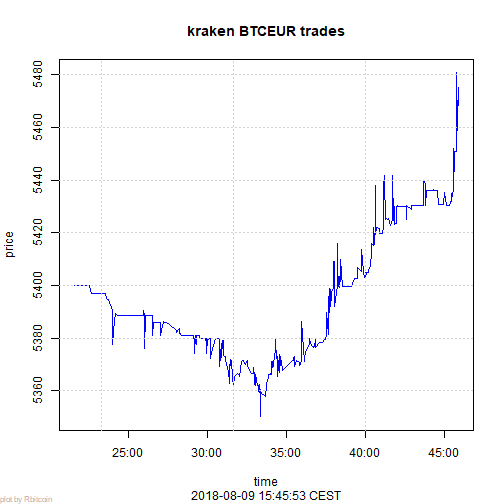

Introduction to R
========================================================
author: Jan Vandepitte
date: 30 August 2018
autosize: true
---


0. What is R
========================================================

  * Open source Script language for statistical programming 
  * data preparation, machine learning, experimentation, visualization (presentation, notebook, shiny dashboard)
  * packaging system (CRAN) like nuget, npm

```r
x <- 1
x + 1
```

```
[1] 2
```

0.1 Origins in LISP
========================================================
LISP -> Scheme -> S -> R (cfr Ecmascript)
 * REPL
 * lambda's
 * reflection (code is data)
 * dynamic (if it quacks like a duck)
 * abstract away underlying system (for domain experts)
 * backed by fast C++, C or Fortran libraries
 * column oriented data structure (APL influence) 
 
 http://paulgraham.com/icad.html
 

0.2 Origins in LISP (demo)
========================================================


```r
myF <- function(x) { x+1 }
myF
```

```
function(x) { x+1 }
```

```r
myF(1)
```

```
[1] 2
```

```r
apply(matrix(c(1,2,3,4),2,2),1,myF)
```

```
     [,1] [,2]
[1,]    2    3
[2,]    4    5
```

1. Why R
========================================================

  * AI coming out of winter (pit of dispair)
  * Omnipresent in AI (Skill like SQL, Ecmascript)
  * Open source, Eco-system, History (de facto standard)
  * different backends (citizen scientist, Big Data, Keras backend)
  * Backed by and integrated in Microsoft products

1.1 Notable R tools in ecosystem
======================================================== 
 * packages: https://cran.r-project.org/
 * IDE Rstudio: https://www.rstudio.com/
 * notable R packages:
   * [dplyr](https://dplyr.tidyverse.org/) and derivatives: high level data wrangling 
   * [shiny](https://shiny.rstudio.com/) : Interactive dashboarding
   * [RCurl](http://www.omegahat.net/RCurl/) : Get data from an API
   * [knitR](https://yihui.name/knitr/): Mix markdown and R (this pres)
   * [ggplot2](http://ggplot2.org/) : Nice graphs
   * [lattice](http://lattice.r-forge.r-project.org/) : Multivariate graphs
   * [devtools](https://www.rstudio.com/products/rpackages/devtools/) : Get packages straight from github and more fun
   * [tableplot](https://cran.r-project.org/web/packages/tabplot/vignettes/tabplot-vignette.html): visualize big datasets
   
1.2 Checklist: Is R the tool for me right now?
========================================================
 * Do I want to use free (like beer) software : yes
 * Do I want to experiment with different models from different creators : yes 
 * Does my data fit in main memory of my computer (no big data ): yes
 * Doesn't my data fit in main memory of my computer : yes with some prerequisites
  
2. R in Microsoft products
========================================================

 * 2015 Microsoft buys Revolution Analytics 
 * R Integrated in several products
 * https://mran.microsoft.com


2.1 Microsoft R Open (R extension)
========================================================
Improved some pittfals of typical R distribution (single threaded, standardization of packages and models, object orientation...) CRAN

(see Typescript)


2.2 Microsoft Machine Learning Server (run time)
========================================================
Client/Server
Operationalizing R 
  * DeployR
  * ScaleR

Now also python

2.3 Microsoft R Archive Network (MRAN)
========================================================
Standardized package, snapshotting in time
https://mran.microsoft.com/

2.4 R in SQL Server
========================================================
Machine learning services in SQL Server


2.5 R in visual studio
========================================================


2.6 R in Power BI
========================================================
Visualization with R? PowerBIR?? (jk :p)


2.7 Azure machine learning
========================================================


2.8 Azure HDInsight (hadoop as a service)
========================================================


http://blog.revolutionanalytics.com/2015/06/using-hadoop-with-r-it-depends.html

2.9 Azure Databricks (spark as a service)
========================================================
R one of the languages on Apache Spark (besides Scala and Python)


2.10 In minecraft
========================================================


https://ropenscilabs.github.io/miner_book/

2.11 Certification as a Data Scientist
========================================================


3. Concepts
========================================================
In the following segment I try to provide a high level run through of basic concepts of AI, machine learning and statistics

3.1 AI
========================================================


3.2 DIKW pyramid
========================================================


3.3 DIKW cycle
========================================================


3.4 Statistics and Machine learning
========================================================


3.5 Error terms
========================================================
Reduce Errors Of Our Models (fix bugs? unit testing?): Stochastical element.


3.6 Error types : hypothesis testing
========================================================


* type I : incorrectly detect effect when there is none (bias, noise...) : overfitting
* type II : incorrectly detect no effect (0 hypothesis) when there is an effect : underfitting

Programming = mathematical proof testen (https://en.wikipedia.org/wiki/Curry%E2%80%93Howard_correspondence)

3.7 Information = Variance
========================================================


we train our model and test/validate it on the same data

3.7 Information = Variance
========================================================


How related is our training, test our validation data subset? Idempotency of our model.

3.8 Big data - Central Limit Theorem
========================================================
Larger sample size: more normal distribution


with more data, we need less assumptions of underlying error term


3.9 Big data - Power increases with sample size
========================================================


Power is chance that our model will correctly detect an effect. Power will decrease with more features in our model. Power will increase with larger sample size for our model.


3.10 Big data - Data is the new oil
========================================================

Conclusion: the more (quality) data, the better for our models


New headaches: Horizontal scalability, distributed systems, CAP theoreum ...


3.11 Deep learning
========================================================
deep neural networks, more data and faster hardware (GPU)


> When in doubt use brute force ~ Ken Thompson


3.12 Deep learning
========================================================

Renewed interest so some interesting developments
* Auto-encoder (encoder-decoder chained learned with internal representation)
* SEQ2SEQ (arbitrary size representation for e.g. NLP)
* Representation learning (less feature engineering)
* Theoretical framework (category theory): a new way of programming but with linear algebra
http://colah.github.io/posts/2015-09-NN-Types-FP/

3.13 Deep dive theoretical
========================================================

* Basic statistics : https://www.itl.nist.gov/div898/handbook/
* Machine learning : https://dzone.com/articles/35-free-online-books-machine
* https://www.kdnuggets.com/

3.14 Level I in Causal hierarchy
========================================================


https://arxiv.org/pdf/1801.04016.pdf

https://www.quantamagazine.org/to-build-truly-intelligent-machines-teach-them-cause-and-effect-20180515/

3.15 Simpson paradox
========================================================


4. R for the .NET programmer
========================================================
In knitR it's also possible to run code from other languages:
  * https://yihui.name/knitr/demo/engines/
  * http://datadrivensecurity.info/blog/posts/2015/Jun/running-other-languages-in-r-markdown-files/
So let's add an engine for .net

```r
eng_dotnet <- function(options) {
  # create a temporary file

  f <- basename(tempfile("dotnet", '.', paste('.', "dotnet", sep = '')))
  on.exit(unlink(f)) # cleanup temp file on function exit
  writeLines(options$code, f)
  
  out <- ''
  # if eval != FALSE compile/run the code, preserving output
  if (options$eval) {
    # https://github.com/filipw/dotnet-script : 
    # choco install dotnet.script 
    # or 
    # dotnet tool install -g dotnet-script (preferred)
    out <- system(sprintf('dotnet script %s', paste(f, options$engine.opts)), intern=TRUE)
  }
  # spit back stuff to the user
  engine_output(options, options$code, out)
}
knitr::knit_engines$set(dotnet=eng_dotnet)
```
4.1 Let's try out our new engine
========================================================

```dotnet
var i = 1;
i++;
Console.WriteLine(i++);
Console.WriteLine(++i);
Console.WriteLine(i--);
Console.WriteLine(--i);
```

```
2
4
4
2
```

4.2 Basic types (.NET)
========================================================

```dotnet
Console.WriteLine(1);
Console.WriteLine(true);
Console.WriteLine("hello world?");
enum Color {Red, Green, Blue};  
Console.WriteLine(Color.Red);
```

```
1
True
hello world?
Red
```

4.2 Basic types (R)
========================================================

```r
1
```

```
[1] 1
```

```r
2.0
```

```
[1] 2
```

```r
T
```

```
[1] TRUE
```

```r
'hello world?'
```

```
[1] "hello world?"
```

```r
as.factor(c('Red','Green','Blue'))[1];
```

```
[1] Red
Levels: Blue Green Red
```

```r
as.ordered(c('Best','Bester','Bestest'))[1];
```

```
[1] Best
Levels: Best < Bester < Bestest
```

4.3 Collections and composite types (.NET)
========================================================

```dotnet
Console.WriteLine(new [] { 1 , 2 , 3}[1]);
Console.WriteLine(new List<object> { "Fred" , 20}[0]);
Console.WriteLine(new Dictionary<string,object>{{"name","Fred"},{"age",20}}["name"]);
Console.WriteLine(new { Name = "Fred", Age = 20});
```

```
2
Fred
Fred
{ Name = Fred, Age = 20 }
```

4.3 Collections and composite types (R)
========================================================

```r
c(1,2,3)
```

```
[1] 1 2 3
```

```r
matrix(1:9, nrow=3,ncol=3)
```

```
     [,1] [,2] [,3]
[1,]    1    4    7
[2,]    2    5    8
[3,]    3    6    9
```

```r
list(name="Fred",  age=20)
```

```
$name
[1] "Fred"

$age
[1] 20
```

```r
# R has at least three ways to do OO (S3, S4, Reference class) but don't bother do FP rather
```

4.3 Collections and composite types (R)
========================================================

```r
array(1:16,dim = c(2,2,2,2))[,,2,2]
```

```
     [,1] [,2]
[1,]   13   15
[2,]   14   16
```

```r
data.frame(name = c("Buddy", "Lisa"), age = c(10, 38), sex = as.factor(c("m","f")))
```

```
   name age sex
1 Buddy  10   m
2  Lisa  38   f
```

4.4 Functions (.NET)
========================================================

```dotnet
Func<int,int> myF = (int x) => x + 1;
Console.WriteLine(myF);
Console.WriteLine(myF(1));
Console.WriteLine(new [] {1 , 2 , 3 , 4}.Select(myF).FirstOrDefault());
```

```
System.Func`2[System.Int32,System.Int32]
2
2
```

4.4 Functions (R)
========================================================

```r
myF <- function(x) { x+1 }
myF
```

```
function(x) { x+1 }
```

```r
myF(1)
```

```
[1] 2
```

```r
apply(matrix(c(1,2,3,4),2,2),1,myF)
```

```
     [,1] [,2]
[1,]    2    3
[2,]    4    5
```

4.5 Deep dive into R
========================================================

start here:
* https://www.statmethods.net/
* https://www.r-bloggers.com/
* https://www.datacamp.com/

then google (CRAN because R is to confusing for google)

5. Demo's
========================================================
  * supply chain analysis : 
    * https://github.com/yenwel/SCOperationsInventory
    * https://github.com/yenwel/supplychainplanning
  * shiny app connecting to database: https://github.com/yenwel/shinyDatabaseExplorer
  * analyse load tests (connect to db): https://github.com/yenwel/analyse-neustar-loadtest
  * process IIS Url Rewrite xml: https://github.com/yenwel/processsUrlRewrite
  * this presentation: https://github.com/yenwel/R-presentation
  * An R-package for the knitr dotnet engine: https://github.com/yenwel/Rpresdotnetengine

5.1 Shiny App
========================================================

<iframe src="https://bovi-analytics.shinyapps.io/GplusEdata/" width="100%" height ="300%"></iframe>

5.2.1 data mining bitcoin and twitter
========================================================

```r
#http://beautifuldata.net/2015/01/querying-the-bitcoin-blockchain-with-r/
library(Rbitcoin)
trades <- market.api.process('kraken',c('BTC','EUR'),'trades')
Rbitcoin.plot(trades, col='blue')
```



5.2.2 data mining bitcoin and twitter
========================================================

```r
#https://www.earthdatascience.org/courses/earth-analytics/get-data-using-apis/use-twitter-api-r/
library(rtweet)
```

5.2.3 datamining bitcoin and twitter
========================================================

```r
#https://www.rdocumentation.org/packages/MSBVAR/versions/0.9-2/topics/granger.test
#https://davegiles.blogspot.com/2012/11/granger-causality-testing-in-r.html
```


