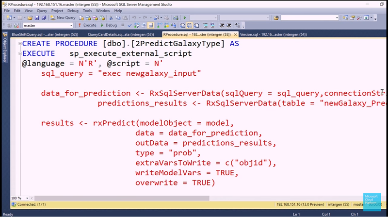
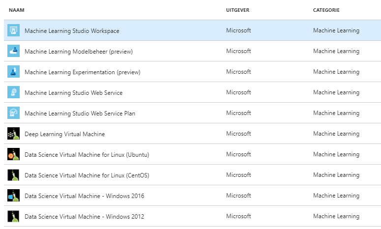
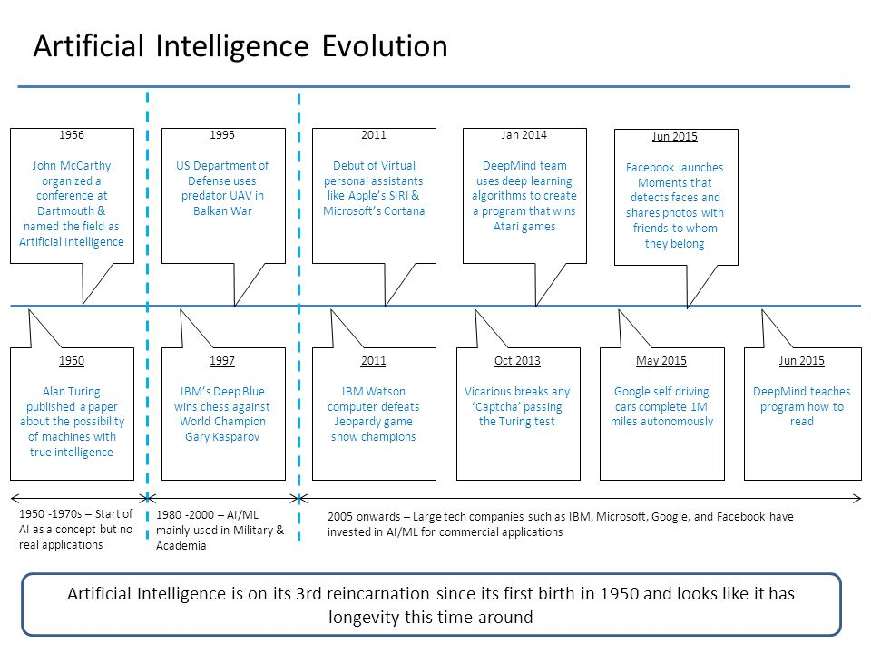

Introduction to R
========================================================
author: Jan Vandepitte
date: 30 August 2018
autosize: true
---


0. What is R
========================================================

  * Open source Script language for statistical programming 
  * data preparation, machine learning, experimentation, visualization (presentation, notebook, shiny dashboard)
  * packaging system (CRAN) like nuget, npm

```r
x <- 1
x + 1
```

```
[1] 2
```

0.1 Origins in LISP
========================================================
LISP -> Scheme -> S -> R (cfr Ecmascript)
 * REPL
 * lambda's
 * reflection (code is data)
 * dynamic (if it quacks like a duck)
 * abstract away underlying system (for domain experts)
 * backed by fast C++, C or Fortran libraries
 * column oriented data structure (APL influence) 
 
 http://paulgraham.com/icad.html
 

0.2 Origins in LISP (demo)
========================================================


```r
myF <- function(x) { x+1 }
myF
```

```
function(x) { x+1 }
```

```r
myF(1)
```

```
[1] 2
```

```r
apply(matrix(c(1,2,3,4),2,2),1,myF)
```

```
     [,1] [,2]
[1,]    2    3
[2,]    4    5
```

1. Why R
========================================================

  * AI coming out of winter (pit of dispair)
  * Omnipresent in AI (Skill like SQL, Ecmascript)
  * Open source, Eco-system, History (de facto standard)
  * different backends (citizen scientist, Big Data, Keras backend)
  * Backed by and integrated in Microsoft products

1.1 Notable R tools in ecosystem
======================================================== 
 * packages: https://cran.r-project.org/
 * IDE Rstudio: https://www.rstudio.com/
 * notable R packages:
   * [dplyr](https://dplyr.tidyverse.org/) and derivatives: high level data wrangling 
   * [shiny](https://shiny.rstudio.com/) : Interactive dashboarding
   * [RCurl](http://www.omegahat.net/RCurl/) : Get data from an API
   * [knitR](https://yihui.name/knitr/): Mix markdown and R (this pres)
   * [ggplot2](http://ggplot2.org/) : Nice graphs
   * [lattice](http://lattice.r-forge.r-project.org/) : Multivariate graphs
   * [devtools](https://www.rstudio.com/products/rpackages/devtools/) : Get packages straight from github and more fun
   * [tableplot](https://cran.r-project.org/web/packages/tabplot/vignettes/tabplot-vignette.html): visualize big datasets
   
1.2 Checklist: Is R the tool for me right now?
========================================================
 * Do I want to use free (like beer) software : yes
 * Do I want to experiment with different models from different creators : yes 
 * Does my data fit in main memory of my computer (no big data ): yes
 * Doesn't my data fit in main memory of my computer : yes with some prerequisites
  
2. R in Microsoft products
========================================================

 * 2015 Microsoft buys Revolution Analytics 
 * R Integrated in several products
 * https://mran.microsoft.com


2.1 Microsoft R Open (R extension)
========================================================
Improved some pittfals of typical R distribution (single threaded, standardization of packages and models, object orientation...) CRAN

(see Typescript)


2.2 Microsoft Machine Learning Server (run time)
========================================================
Client/Server
Operationalizing R 
  * DeployR
  * ScaleR

Now also python

2.3 Microsoft R Archive Network (MRAN)
========================================================
Standardized package, snapshotting in time
https://mran.microsoft.com/

2.4 R in SQL Server
========================================================
Machine learning services in SQL Server



2.5 R in visual studio
========================================================


2.6 R in Power BI
========================================================
Visualization with R? PowerBIR?? (jk :p)


2.7 Azure machine learning
========================================================


2.8 Azure HDInsight (hadoop as a service)
========================================================


http://blog.revolutionanalytics.com/2015/06/using-hadoop-with-r-it-depends.html

2.9 Azure Databricks (spark as a service)
========================================================
R one of the languages on Apache Spark (besides Scala and Python)


2.10 In minecraft
========================================================


https://ropenscilabs.github.io/miner_book/

2.11 Certification as a Data Scientist
========================================================


3. Concepts
========================================================
In the following segment I try to provide a high level run through of basic concepts of AI, machine learning and statistics

3.1 AI
========================================================


3.2 DIKW pyramid
========================================================


3.3 DIKW cycle
========================================================


3.4 Statistics and Machine learning
========================================================


3.5 Error terms
========================================================
In programming we try to reduce the errors in our models (programs) by fixing bugs and doing unit testing.

Reduce Errors Of Our statistical models :
Stochastical element. Error is quantifiable with data.

3.5 Error terms
========================================================


Model is estimation of errorterms of data around model


3.5 Error terms
========================================================


Error has a probability distribution around: assumed to be normal distributed

3.6 Error types : hypothesis testing
========================================================


3.6 Error types : hypothesis testing
========================================================
* type I : incorrectly detect effect when there is none (bias, noise...) : overfitting
* type II : incorrectly detect no effect (0 hypothesis) when there is an effect : underfitting

Programming = mathematical proof testen (https://en.wikipedia.org/wiki/Curry%E2%80%93Howard_correspondence)

3.7 Information = Variance
========================================================


we train our model and test/validate it on the same data

3.7 Information = Variance
========================================================


How related is our training, test our validation data subset? Idempotency of our model.

3.8 Big data - Central Limit Theorem
========================================================
Larger sample size: more normal distribution


with more data, we need less assumptions of underlying error term


3.9 Big data - Power increases with sample size
========================================================


Power is chance that our model will correctly detect an effect. Power will decrease with more features in our model. Power will increase with larger sample size for our model.


3.10 Big data - Data is the new oil
========================================================

Conclusion: the more (quality) data, the better for our models


New headaches: Horizontal scalability, distributed systems, CAP theoreum ...


3.11 Deep learning
========================================================
deep neural networks, more data and faster hardware (GPU)


> When in doubt use brute force ~ Ken Thompson


3.12 Deep learning
========================================================

Renewed interest so some interesting developments
* Auto-encoder (encoder-decoder chained learned with internal representation)
* SEQ2SEQ (arbitrary size representation for e.g. NLP)
* Representation learning (less feature engineering)
* Theoretical framework (category theory): a new way of programming but with linear algebra
http://colah.github.io/posts/2015-09-NN-Types-FP/

3.13 Deep dive theoretical
========================================================

* Basic statistics : https://www.itl.nist.gov/div898/handbook/
* Machine learning : https://dzone.com/articles/35-free-online-books-machine
* https://www.kdnuggets.com/

3.14 Level I in Causal hierarchy
========================================================


https://arxiv.org/pdf/1801.04016.pdf

https://www.quantamagazine.org/to-build-truly-intelligent-machines-teach-them-cause-and-effect-20180515/

3.15 Simpson paradox
========================================================


4. R for the .NET programmer
========================================================
In knitR it's also possible to run code from other languages:
  * https://yihui.name/knitr/demo/engines/
  * http://datadrivensecurity.info/blog/posts/2015/Jun/running-other-languages-in-r-markdown-files/

So let's add an engine for .net

```r
eng_dotnet <- function(options) {
  # create a temporary file
  f <- basename(tempfile("dotnet", '.', paste('.', "dotnet", sep = '')))
  on.exit(unlink(f)) # cleanup temp file on function exit
  writeLines(options$code, f)
  out <- ''
  # if eval != FALSE compile/run the code, preserving output
  if (options$eval) {
    out <- system(sprintf('dotnet script %s', paste(f, options$engine.opts)), intern=TRUE)
  }
  # spit back stuff to the user
  engine_output(options, options$code, out)
}
knitr::knit_engines$set(dotnet=eng_dotnet)
```
4.0 Let's try out our R-package
========================================================

```r
if (!requireNamespace("devtools", quietly = TRUE)) { install.packages("devtools") }
devtools::install_github("yenwel/Rpresdotnetengine", force=T)
library(Rpresdotnetengine)
knitr::knit_engines$set(dotnet=eng_dotnet)
```

4.1 Let's try out our new engine
========================================================

```dotnet
var i = 1;
i++;
Console.WriteLine(i++);
Console.WriteLine(++i);
Console.WriteLine(i--);
Console.WriteLine(--i);
```

```
2
4
4
2
```

4.2 Basic types (.NET)
========================================================

```dotnet
Console.WriteLine(1);
Console.WriteLine(true);
Console.WriteLine("hello world?");
enum Color {Red, Green, Blue};  
Console.WriteLine(Color.Red);
```

```
1
True
hello world?
Red
```

4.2 Basic types (R)
========================================================

```r
1
```

```
[1] 1
```

```r
2.0
```

```
[1] 2
```

```r
T
```

```
[1] TRUE
```

```r
'hello world?'
```

```
[1] "hello world?"
```

```r
as.factor(c('Red','Green','Blue'))[1];
```

```
[1] Red
Levels: Blue Green Red
```

```r
as.ordered(c('Best','Bester','Bestest'))[1];
```

```
[1] Best
Levels: Best < Bester < Bestest
```

4.3 Collections and composite types (.NET)
========================================================

```dotnet
Console.WriteLine(new [] { 1 , 2 , 3}[1]);
Console.WriteLine(new List<object> { "Fred" , 20}[0]);
Console.WriteLine(new Dictionary<string,object>{{"name","Fred"},{"age",20}}["name"]);
Console.WriteLine(new { Name = "Fred", Age = 20});
```

```
2
Fred
Fred
{ Name = Fred, Age = 20 }
```

4.3 Collections and composite types (R)
========================================================

```r
c(1,2,3)
```

```
[1] 1 2 3
```

```r
matrix(1:9, nrow=3,ncol=3)
```

```
     [,1] [,2] [,3]
[1,]    1    4    7
[2,]    2    5    8
[3,]    3    6    9
```

```r
list(name="Fred",  age=20)
```

```
$name
[1] "Fred"

$age
[1] 20
```

```r
# R has at least three ways to do OO (S3, S4, Reference class) but don't bother do FP rather
```

4.3 Collections and composite types (R)
========================================================

```r
array(1:16,dim = c(2,2,2,2))[,,2,2]
```

```
     [,1] [,2]
[1,]   13   15
[2,]   14   16
```

```r
data.frame(name = c("Buddy", "Lisa"), age = c(10, 38), sex = as.factor(c("m","f")))
```

```
   name age sex
1 Buddy  10   m
2  Lisa  38   f
```

4.4 Functions (.NET)
========================================================

```dotnet
Func<int,int> myF = (int x) => x + 1;
Console.WriteLine(myF);
Console.WriteLine(myF(1));
Console.WriteLine(new [] {1 , 2 , 3 , 4}.Select(myF).FirstOrDefault());
```

```
System.Func`2[System.Int32,System.Int32]
2
2
```

4.4 Functions (R)
========================================================

```r
myF <- function(x) { x+1 }
myF
```

```
function(x) { x+1 }
```

```r
myF(1)
```

```
[1] 2
```

```r
apply(matrix(c(1,2,3,4),2,2),1,myF)
```

```
     [,1] [,2]
[1,]    2    3
[2,]    4    5
```

4.5 Deep dive into R
========================================================

start here:
* https://www.statmethods.net/
* https://www.r-bloggers.com/
* https://www.datacamp.com/

then google (CRAN because R is to confusing for google)


```r
??something
```

5. Demo's
========================================================
  * supply chain analysis : 
    * https://github.com/yenwel/SCOperationsInventory
    * https://github.com/yenwel/supplychainplanning
  * shiny app connecting to database: https://github.com/yenwel/shinyDatabaseExplorer
  * analyse load tests (connect to db): https://github.com/yenwel/analyse-neustar-loadtest
  * process IIS Url Rewrite xml: https://github.com/yenwel/processsUrlRewrite
  * this presentation: https://github.com/yenwel/R-presentation
  * An R-package for the knitr dotnet engine: https://github.com/yenwel/Rpresdotnetengine

5.1 Shiny App
========================================================

<iframe src="https://bovi-analytics.shinyapps.io/GplusEdata/" width="100%" height ="300%"></iframe>

5.2.1 data mining bitcoin and twitter
========================================================

```r
#http://beautifuldata.net/2015/01/querying-the-bitcoin-blockchain-with-r/
library(Rbitcoin)
trades <- market.api.process('kraken',c('BTC','EUR'),'trades')
Rbitcoin.plot(trades, col='blue')
```


5.2.2 data mining bitcoin and twitter
========================================================


```r
## load rtweet package
library(rtweet)
# these environment variables are set via an app you can make at https://developer.twitter.com/en/apps
envvar <- Sys.getenv(c("TWT_R_APP", "TWT_R_API", "TWT_R_SECRET","TWT_R_XS_TOKEN","TWT_R_XS_SECRET"))
appname <- envvar[1]
key <- envvar[2]
secret <- envvar[3]
access_token <- envvar[4]
access_secret <- envvar[5]
## authenticate via access token
token <- create_token(
  app = appname, 
  consumer_key = key, 
  consumer_secret = secret, 
  access_token = access_token, 
  access_secret = access_secret)
bitcoin_tweets <- search_tweets(q = "#bitcoin", n = 50)
```

5.2.3 datamining bitcoin and twitter
========================================================

```r
str(trades)
```

```
List of 6
 $ market          : chr "kraken"
 $ base            : chr "BTC"
 $ quote           : chr "EUR"
 $ timestamp       : POSIXct[1:1], format: "2018-08-10 12:54:32"
 $ market_timestamp: POSIXct[1:1], format: NA
 $ trades          :Classes 'data.table' and 'data.frame':	1000 obs. of  5 variables:
  ..$ date  : POSIXct[1:1000], format: "2018-08-10 09:26:13" ...
  ..$ price : num [1:1000] 5525 5525 5524 5522 5520 ...
  ..$ amount: num [1:1000] 0.25 0.0135 0.01 0.05 0.022 ...
  ..$ tid   : chr [1:1000] NA NA NA NA ...
  ..$ type  : chr [1:1000] "ask" "ask" "ask" "ask" ...
  ..- attr(*, ".internal.selfref")=<externalptr> 
```
5.2.3 datamining bitcoin and twitter
========================================================

```r
summary(trades)
```

```
                 Length Class      Mode     
market           1      -none-     character
base             1      -none-     character
quote            1      -none-     character
timestamp        1      POSIXct    numeric  
market_timestamp 1      POSIXct    numeric  
trades           5      data.table list     
```
5.2.3 datamining bitcoin and twitter
========================================================

```r
summary(trades$trades)
```

```
      date                         price          amount        
 Min.   :2018-08-10 09:26:13   Min.   :5520   Min.   : 0.00000  
 1st Qu.:2018-08-10 09:40:06   1st Qu.:5546   1st Qu.: 0.00500  
 Median :2018-08-10 10:02:02   Median :5555   Median : 0.02501  
 Mean   :2018-08-10 10:05:48   Mean   :5553   Mean   : 0.23682  
 3rd Qu.:2018-08-10 10:30:28   3rd Qu.:5560   3rd Qu.: 0.17526  
 Max.   :2018-08-10 10:54:27   Max.   :5583   Max.   :14.03073  
     tid                type          
 Length:1000        Length:1000       
 Class :character   Class :character  
 Mode  :character   Mode  :character  
                                      
                                      
                                      
```
5.2.3 datamining bitcoin and twitter
========================================================

```r
str(bitcoin_tweets)
```

```
Classes 'tbl_df', 'tbl' and 'data.frame':	40 obs. of  88 variables:
 $ user_id                : chr  "924026919993139200" "411525843" "971504962739036161" "885224342489096194" ...
 $ status_id              : chr  "1027870729432256513" "1027870725330423808" "1027870717700972544" "1027870711237365761" ...
 $ created_at             : POSIXct, format: "2018-08-10 10:54:13" "2018-08-10 10:54:12" ...
 $ screen_name            : chr  "Blawksy" "cryptopank" "serhio_coin88" "1bitcoin2" ...
 $ text                   : chr  "‘Game Over’: Wall Street Analyst Says #Bitcoin Must Not Breech Year-To-Date Support https://t.co/2KlXLuvUWr htt"| __truncated__ "Goldman Sachs May Store Bitcoin for Cryptocurrency Funds, Institutional Investors. The future of #crypto is loo"| __truncated__ "Aenco Co-founder @DarrenLui1 was live-stream interviewed on Facebook by Joe Blackburn, the founder and CEO of @"| __truncated__ "‘Game Over’: Wall Street Analyst Says #bitcoin Must Not Breech Year-To-Date Support https://t.co/Y7LLutvHZO" ...
 $ source                 : chr  "dlvr.it" "Twitter Lite" "Twitter for Android" "dlvr.it" ...
 $ display_text_width     : num  107 140 139 107 69 69 119 140 272 140 ...
 $ reply_to_status_id     : chr  NA NA NA NA ...
 $ reply_to_user_id       : chr  NA NA NA NA ...
 $ reply_to_screen_name   : chr  NA NA NA NA ...
 $ is_quote               : logi  FALSE FALSE FALSE FALSE FALSE FALSE ...
 $ is_retweet             : logi  FALSE TRUE TRUE FALSE FALSE FALSE ...
 $ favorite_count         : int  0 0 0 0 0 0 0 0 0 0 ...
 $ retweet_count          : int  0 1093 1555 0 0 0 0 78 0 5 ...
 $ hashtags               :List of 40
  ..$ : chr "Bitcoin"
  ..$ : chr "crypto"
  ..$ : chr NA
  ..$ : chr "bitcoin"
  ..$ : chr "bitcoin"
  ..$ : chr "bitcoin"
  ..$ : chr  "Bitcoin" "BTC"
  ..$ : chr "Crypto"
  ..$ : chr  "PoW" "PoS" "æternity" "Bitcoin" ...
  ..$ : chr  "Bitcoin" "Crypto" "Airdrop" "eByte" ...
  ..$ : chr  "eos" "crypto" "cryptocurrency" "bitcoin" ...
  ..$ : chr "Bitcoin"
  ..$ : chr  "tech" "cyber" "web" "php" ...
  ..$ : chr  "blockchain" "cryptocurrency" "bitcoin" "ethereum" ...
  ..$ : chr "Bitcoin"
  ..$ : chr "Bitcoin"
  ..$ : chr  "SocialRemit" "bitcoin" "cryptocurrency"
  ..$ : chr NA
  ..$ : chr NA
  ..$ : chr  "blockchain" "cryptosystems"
  ..$ : chr NA
  ..$ : chr "Bitcoin"
  ..$ : chr  "bitcoin" "mining" "binance" "btc" ...
  ..$ : chr "ULTRIX"
  ..$ : chr NA
  ..$ : chr NA
  ..$ : chr  "blockchain" "cryptocurreny" "bitcoin" "litecoin" ...
  ..$ : chr  "BITCOIN" "Crypto"
  ..$ : chr  "PueblaFC" "Veracruz" "1xbit" "bitcoin"
  ..$ : chr  "Bitcoin" "Blockchain" "Cryptocurrency"
  ..$ : chr  "Infographic" "IoT" "Industry40" "CyberSecurity" ...
  ..$ : chr  "crypto" "bitcoin"
  ..$ : chr NA
  ..$ : chr "Bitcoin"
  ..$ : chr "Crypto"
  ..$ : chr NA
  ..$ : chr  "ico" "airdrop"
  ..$ : chr  "mining" "Fastcoin" "Emerald" "GameCredits" ...
  ..$ : chr "bitcoin"
  ..$ : chr  "crypto" "bitcoin"
 $ symbols                :List of 40
  ..$ : chr NA
  ..$ : chr NA
  ..$ : chr NA
  ..$ : chr NA
  ..$ : chr NA
  ..$ : chr NA
  ..$ : chr NA
  ..$ : chr NA
  ..$ : chr NA
  ..$ : chr NA
  ..$ : chr "eos"
  ..$ : chr NA
  ..$ : chr NA
  ..$ : chr NA
  ..$ : chr NA
  ..$ : chr NA
  ..$ : chr NA
  ..$ : chr NA
  ..$ : chr NA
  ..$ : chr NA
  ..$ : chr NA
  ..$ : chr NA
  ..$ : chr NA
  ..$ : chr NA
  ..$ : chr NA
  ..$ : chr NA
  ..$ : chr  "BTC" "ETH" "XRP" "BCH" ...
  ..$ : chr NA
  ..$ : chr NA
  ..$ : chr NA
  ..$ : chr NA
  ..$ : chr NA
  ..$ : chr NA
  ..$ : chr NA
  ..$ : chr NA
  ..$ : chr NA
  ..$ : chr NA
  ..$ : chr NA
  ..$ : chr NA
  ..$ : chr NA
 $ urls_url               :List of 40
  ..$ : chr "s.blawks.com/QfR7W5"
  ..$ : chr NA
  ..$ : chr NA
  ..$ : chr "cointelegraph.com/news/game-over…"
  ..$ : chr "dlvr.it/QfR7JW"
  ..$ : chr "dlvr.it/QfR7F7"
  ..$ : chr NA
  ..$ : chr "cryptosouk.io/en/ico"
  ..$ : chr "bit.ly/2ME7B4g"
  ..$ : chr NA
  ..$ : chr NA
  ..$ : chr NA
  ..$ : chr NA
  ..$ : chr "twitter.com/p2psf/status/1…"
  ..$ : chr "ift.tt/2OpkTTT"
  ..$ : chr NA
  ..$ : chr "twitter.com/Socialremit_uk…"
  ..$ : chr NA
  ..$ : chr NA
  ..$ : chr NA
  ..$ : chr NA
  ..$ : chr NA
  ..$ : chr NA
  ..$ : chr NA
  ..$ : chr "Cryptology.com"
  ..$ : chr NA
  ..$ : chr "newsbtc.com/2018/08/10/5-r…"
  ..$ : chr "twitter.com/EonToken/statu…"
  ..$ : chr "bit.ly/2Oo1XEc"
  ..$ : chr NA
  ..$ : chr NA
  ..$ : chr NA
  ..$ : chr NA
  ..$ : chr NA
  ..$ : chr "cryptosouk.io/en/ico"
  ..$ : chr NA
  ..$ : chr "medium.com/localtokenexch…"
  ..$ : chr NA
  ..$ : chr "ow.ly/EqK130llAwG"
  ..$ : chr NA
 $ urls_t.co              :List of 40
  ..$ : chr "https://t.co/2KlXLuvUWr"
  ..$ : chr NA
  ..$ : chr NA
  ..$ : chr "https://t.co/Y7LLutvHZO"
  ..$ : chr "https://t.co/V0vmoshMN7"
  ..$ : chr "https://t.co/ujqCzqVjwn"
  ..$ : chr NA
  ..$ : chr "https://t.co/onG1lV26QW"
  ..$ : chr "https://t.co/V3TCO8BCs2"
  ..$ : chr NA
  ..$ : chr NA
  ..$ : chr NA
  ..$ : chr NA
  ..$ : chr "https://t.co/y1b2ilZitJ"
  ..$ : chr "https://t.co/raXOl0Jjov"
  ..$ : chr NA
  ..$ : chr "https://t.co/NfYtJTumcF"
  ..$ : chr NA
  ..$ : chr NA
  ..$ : chr NA
  ..$ : chr NA
  ..$ : chr NA
  ..$ : chr NA
  ..$ : chr NA
  ..$ : chr "https://t.co/DicVX5Vpuz"
  ..$ : chr NA
  ..$ : chr "https://t.co/5E13gs5uTQ"
  ..$ : chr "https://t.co/NBIYHaLtKO"
  ..$ : chr "https://t.co/T5ekWB9BLY"
  ..$ : chr NA
  ..$ : chr NA
  ..$ : chr NA
  ..$ : chr NA
  ..$ : chr NA
  ..$ : chr "https://t.co/onG1lV26QW"
  ..$ : chr NA
  ..$ : chr "https://t.co/iiWDR46bug"
  ..$ : chr NA
  ..$ : chr "https://t.co/rK88CaFMcw"
  ..$ : chr NA
 $ urls_expanded_url      :List of 40
  ..$ : chr "http://s.blawks.com/QfR7W5"
  ..$ : chr NA
  ..$ : chr NA
  ..$ : chr "https://cointelegraph.com/news/game-over-wall-street-analyst-says-bitcoin-must-not-breech-year-to-date-support?"| __truncated__
  ..$ : chr "http://dlvr.it/QfR7JW"
  ..$ : chr "http://dlvr.it/QfR7F7"
  ..$ : chr NA
  ..$ : chr "https://cryptosouk.io/en/ico"
  ..$ : chr "https://bit.ly/2ME7B4g"
  ..$ : chr NA
  ..$ : chr NA
  ..$ : chr NA
  ..$ : chr NA
  ..$ : chr "https://twitter.com/p2psf/status/1009391624873537536"
  ..$ : chr "https://ift.tt/2OpkTTT"
  ..$ : chr NA
  ..$ : chr "https://twitter.com/Socialremit_uk/status/1009541855355129857"
  ..$ : chr NA
  ..$ : chr NA
  ..$ : chr NA
  ..$ : chr NA
  ..$ : chr NA
  ..$ : chr NA
  ..$ : chr NA
  ..$ : chr "http://Cryptology.com"
  ..$ : chr NA
  ..$ : chr "https://www.newsbtc.com/2018/08/10/5-reasons-why-institutional-investors-are-entering-crypto/"
  ..$ : chr "https://twitter.com/EonToken/status/1025220988227600385"
  ..$ : chr "http://bit.ly/2Oo1XEc"
  ..$ : chr NA
  ..$ : chr NA
  ..$ : chr NA
  ..$ : chr NA
  ..$ : chr NA
  ..$ : chr "https://cryptosouk.io/en/ico"
  ..$ : chr NA
  ..$ : chr "https://medium.com/localtokenexchange/our-airdrop-campaign-is-in-full-swing-e15dfeed5edb"
  ..$ : chr NA
  ..$ : chr "http://ow.ly/EqK130llAwG"
  ..$ : chr NA
 $ media_url              :List of 40
  ..$ : chr "http://pbs.twimg.com/media/DkO6-ybUwAISy5I.jpg"
  ..$ : chr NA
  ..$ : chr NA
  ..$ : chr NA
  ..$ : chr "http://pbs.twimg.com/media/DkO68sQV4AAcdLn.jpg"
  ..$ : chr "http://pbs.twimg.com/media/DkO68hPU8AApnYX.jpg"
  ..$ : chr NA
  ..$ : chr NA
  ..$ : chr NA
  ..$ : chr NA
  ..$ : chr "http://pbs.twimg.com/media/DkO6oKOXcAAz6yO.jpg"
  ..$ : chr NA
  ..$ : chr NA
  ..$ : chr NA
  ..$ : chr "http://pbs.twimg.com/media/DjUluH8WwAEf53D.jpg"
  ..$ : chr NA
  ..$ : chr NA
  ..$ : chr NA
  ..$ : chr NA
  ..$ : chr NA
  ..$ : chr NA
  ..$ : chr "http://pbs.twimg.com/media/DkL3FMWX0AA179C.jpg"
  ..$ : chr NA
  ..$ : chr NA
  ..$ : chr NA
  ..$ : chr NA
  ..$ : chr NA
  ..$ : chr NA
  ..$ : chr "http://pbs.twimg.com/media/DkO6uW9U8AAhoQ5.jpg"
  ..$ : chr NA
  ..$ : chr "http://pbs.twimg.com/media/DkO6plvWwAADsDW.jpg"
  ..$ : chr "http://pbs.twimg.com/media/Dj0XH27U0AAKoKM.jpg"
  ..$ : chr NA
  ..$ : chr "http://pbs.twimg.com/media/DkL3FMWX0AA179C.jpg"
  ..$ : chr NA
  ..$ : chr NA
  ..$ : chr NA
  ..$ : chr NA
  ..$ : chr "http://pbs.twimg.com/media/DkKzeFRX0AAYWuT.jpg"
  ..$ : chr "http://pbs.twimg.com/media/Dj0XH27U0AAKoKM.jpg"
 $ media_t.co             :List of 40
  ..$ : chr "https://t.co/1ej7heQ26a"
  ..$ : chr NA
  ..$ : chr NA
  ..$ : chr NA
  ..$ : chr "https://t.co/NPgEp4B1aF"
  ..$ : chr "https://t.co/iX7DU9hiE0"
  ..$ : chr NA
  ..$ : chr NA
  ..$ : chr NA
  ..$ : chr NA
  ..$ : chr "https://t.co/RHbCUBPAAK"
  ..$ : chr NA
  ..$ : chr NA
  ..$ : chr NA
  ..$ : chr "https://t.co/wcG7ZJPOXf"
  ..$ : chr NA
  ..$ : chr NA
  ..$ : chr NA
  ..$ : chr NA
  ..$ : chr NA
  ..$ : chr NA
  ..$ : chr "https://t.co/z1BhrD5BkT"
  ..$ : chr NA
  ..$ : chr NA
  ..$ : chr NA
  ..$ : chr NA
  ..$ : chr NA
  ..$ : chr NA
  ..$ : chr "https://t.co/DB9XsEovH7"
  ..$ : chr NA
  ..$ : chr "https://t.co/y8dtnAtvuP"
  ..$ : chr "https://t.co/NJDmhy16SL"
  ..$ : chr NA
  ..$ : chr "https://t.co/z1BhrD5BkT"
  ..$ : chr NA
  ..$ : chr NA
  ..$ : chr NA
  ..$ : chr NA
  ..$ : chr "https://t.co/Uc0J6R5As3"
  ..$ : chr "https://t.co/NJDmhy16SL"
 $ media_expanded_url     :List of 40
  ..$ : chr "https://twitter.com/Blawksy/status/1027870729432256513/photo/1"
  ..$ : chr NA
  ..$ : chr NA
  ..$ : chr NA
  ..$ : chr "https://twitter.com/feeloox1/status/1027870693742899202/photo/1"
  ..$ : chr "https://twitter.com/BitcoinCoreNews/status/1027870690735603712/photo/1"
  ..$ : chr NA
  ..$ : chr NA
  ..$ : chr NA
  ..$ : chr NA
  ..$ : chr "https://twitter.com/CryptoKeeper888/status/1027870642664878080/photo/1"
  ..$ : chr NA
  ..$ : chr NA
  ..$ : chr NA
  ..$ : chr "https://twitter.com/BTCTN/status/1023765966642139136/photo/1"
  ..$ : chr NA
  ..$ : chr NA
  ..$ : chr NA
  ..$ : chr NA
  ..$ : chr NA
  ..$ : chr NA
  ..$ : chr "https://twitter.com/Xentagz/status/1027655343936098310/photo/1"
  ..$ : chr NA
  ..$ : chr NA
  ..$ : chr NA
  ..$ : chr NA
  ..$ : chr NA
  ..$ : chr NA
  ..$ : chr "https://twitter.com/1xbit_es/status/1027870447638011904/photo/1"
  ..$ : chr NA
  ..$ : chr "https://twitter.com/hudson_chatbots/status/1027870431045410816/photo/1"
  ..$ : chr "https://twitter.com/TheCryptoLark/status/1026001914570334214/photo/1"
  ..$ : chr NA
  ..$ : chr "https://twitter.com/Xentagz/status/1027655343936098310/photo/1"
  ..$ : chr NA
  ..$ : chr NA
  ..$ : chr NA
  ..$ : chr NA
  ..$ : chr "https://twitter.com/CNBC/status/1027580996739362817/photo/1"
  ..$ : chr "https://twitter.com/TheCryptoLark/status/1026001914570334214/photo/1"
 $ media_type             :List of 40
  ..$ : chr "photo"
  ..$ : chr NA
  ..$ : chr NA
  ..$ : chr NA
  ..$ : chr "photo"
  ..$ : chr "photo"
  ..$ : chr NA
  ..$ : chr NA
  ..$ : chr NA
  ..$ : chr NA
  ..$ : chr "photo"
  ..$ : chr NA
  ..$ : chr NA
  ..$ : chr NA
  ..$ : chr "photo"
  ..$ : chr NA
  ..$ : chr NA
  ..$ : chr NA
  ..$ : chr NA
  ..$ : chr NA
  ..$ : chr NA
  ..$ : chr "photo"
  ..$ : chr NA
  ..$ : chr NA
  ..$ : chr NA
  ..$ : chr NA
  ..$ : chr NA
  ..$ : chr NA
  ..$ : chr "photo"
  ..$ : chr NA
  ..$ : chr "photo"
  ..$ : chr "photo"
  ..$ : chr NA
  ..$ : chr "photo"
  ..$ : chr NA
  ..$ : chr NA
  ..$ : chr NA
  ..$ : chr NA
  ..$ : chr "photo"
  ..$ : chr "photo"
 $ ext_media_url          :List of 40
  ..$ : chr "http://pbs.twimg.com/media/DkO6-ybUwAISy5I.jpg"
  ..$ : chr NA
  ..$ : chr NA
  ..$ : chr NA
  ..$ : chr "http://pbs.twimg.com/media/DkO68sQV4AAcdLn.jpg"
  ..$ : chr "http://pbs.twimg.com/media/DkO68hPU8AApnYX.jpg"
  ..$ : chr NA
  ..$ : chr NA
  ..$ : chr NA
  ..$ : chr NA
  ..$ : chr  "http://pbs.twimg.com/media/DkO6oKOXcAAz6yO.jpg" "http://pbs.twimg.com/media/DkO6pZSX4AAqi_O.jpg" "http://pbs.twimg.com/media/DkO6qbwXoAAAg2e.jpg"
  ..$ : chr NA
  ..$ : chr NA
  ..$ : chr NA
  ..$ : chr "http://pbs.twimg.com/media/DjUluH8WwAEf53D.jpg"
  ..$ : chr NA
  ..$ : chr NA
  ..$ : chr NA
  ..$ : chr NA
  ..$ : chr NA
  ..$ : chr NA
  ..$ : chr "http://pbs.twimg.com/media/DkL3FMWX0AA179C.jpg"
  ..$ : chr NA
  ..$ : chr NA
  ..$ : chr NA
  ..$ : chr NA
  ..$ : chr NA
  ..$ : chr NA
  ..$ : chr "http://pbs.twimg.com/media/DkO6uW9U8AAhoQ5.jpg"
  ..$ : chr NA
  ..$ : chr "http://pbs.twimg.com/media/DkO6plvWwAADsDW.jpg"
  ..$ : chr "http://pbs.twimg.com/media/Dj0XH27U0AAKoKM.jpg"
  ..$ : chr NA
  ..$ : chr "http://pbs.twimg.com/media/DkL3FMWX0AA179C.jpg"
  ..$ : chr NA
  ..$ : chr NA
  ..$ : chr NA
  ..$ : chr NA
  ..$ : chr "http://pbs.twimg.com/media/DkKzeFRX0AAYWuT.jpg"
  ..$ : chr "http://pbs.twimg.com/media/Dj0XH27U0AAKoKM.jpg"
 $ ext_media_t.co         :List of 40
  ..$ : chr "https://t.co/1ej7heQ26a"
  ..$ : chr NA
  ..$ : chr NA
  ..$ : chr NA
  ..$ : chr "https://t.co/NPgEp4B1aF"
  ..$ : chr "https://t.co/iX7DU9hiE0"
  ..$ : chr NA
  ..$ : chr NA
  ..$ : chr NA
  ..$ : chr NA
  ..$ : chr  "https://t.co/RHbCUBPAAK" "https://t.co/RHbCUBPAAK" "https://t.co/RHbCUBPAAK"
  ..$ : chr NA
  ..$ : chr NA
  ..$ : chr NA
  ..$ : chr "https://t.co/wcG7ZJPOXf"
  ..$ : chr NA
  ..$ : chr NA
  ..$ : chr NA
  ..$ : chr NA
  ..$ : chr NA
  ..$ : chr NA
  ..$ : chr "https://t.co/z1BhrD5BkT"
  ..$ : chr NA
  ..$ : chr NA
  ..$ : chr NA
  ..$ : chr NA
  ..$ : chr NA
  ..$ : chr NA
  ..$ : chr "https://t.co/DB9XsEovH7"
  ..$ : chr NA
  ..$ : chr "https://t.co/y8dtnAtvuP"
  ..$ : chr "https://t.co/NJDmhy16SL"
  ..$ : chr NA
  ..$ : chr "https://t.co/z1BhrD5BkT"
  ..$ : chr NA
  ..$ : chr NA
  ..$ : chr NA
  ..$ : chr NA
  ..$ : chr "https://t.co/Uc0J6R5As3"
  ..$ : chr "https://t.co/NJDmhy16SL"
 $ ext_media_expanded_url :List of 40
  ..$ : chr "https://twitter.com/Blawksy/status/1027870729432256513/photo/1"
  ..$ : chr NA
  ..$ : chr NA
  ..$ : chr NA
  ..$ : chr "https://twitter.com/feeloox1/status/1027870693742899202/photo/1"
  ..$ : chr "https://twitter.com/BitcoinCoreNews/status/1027870690735603712/photo/1"
  ..$ : chr NA
  ..$ : chr NA
  ..$ : chr NA
  ..$ : chr NA
  ..$ : chr  "https://twitter.com/CryptoKeeper888/status/1027870642664878080/photo/1" "https://twitter.com/CryptoKeeper888/status/1027870642664878080/photo/1" "https://twitter.com/CryptoKeeper888/status/1027870642664878080/photo/1"
  ..$ : chr NA
  ..$ : chr NA
  ..$ : chr NA
  ..$ : chr "https://twitter.com/BTCTN/status/1023765966642139136/photo/1"
  ..$ : chr NA
  ..$ : chr NA
  ..$ : chr NA
  ..$ : chr NA
  ..$ : chr NA
  ..$ : chr NA
  ..$ : chr "https://twitter.com/Xentagz/status/1027655343936098310/photo/1"
  ..$ : chr NA
  ..$ : chr NA
  ..$ : chr NA
  ..$ : chr NA
  ..$ : chr NA
  ..$ : chr NA
  ..$ : chr "https://twitter.com/1xbit_es/status/1027870447638011904/photo/1"
  ..$ : chr NA
  ..$ : chr "https://twitter.com/hudson_chatbots/status/1027870431045410816/photo/1"
  ..$ : chr "https://twitter.com/TheCryptoLark/status/1026001914570334214/photo/1"
  ..$ : chr NA
  ..$ : chr "https://twitter.com/Xentagz/status/1027655343936098310/photo/1"
  ..$ : chr NA
  ..$ : chr NA
  ..$ : chr NA
  ..$ : chr NA
  ..$ : chr "https://twitter.com/CNBC/status/1027580996739362817/photo/1"
  ..$ : chr "https://twitter.com/TheCryptoLark/status/1026001914570334214/photo/1"
 $ ext_media_type         : chr  NA NA NA NA ...
 $ mentions_user_id       :List of 40
  ..$ : chr NA
  ..$ : chr "953409414714810369"
  ..$ : chr  "982149194893770753" "1002513672013565952" "903828825875914753"
  ..$ : chr NA
  ..$ : chr NA
  ..$ : chr NA
  ..$ : chr NA
  ..$ : chr "1009019086926499840"
  ..$ : chr NA
  ..$ : chr "818174358862622720"
  ..$ : chr NA
  ..$ : chr NA
  ..$ : chr "188230539"
  ..$ : chr NA
  ..$ : chr "3367334171"
  ..$ : chr  "2207129125" "2207129125"
  ..$ : chr NA
  ..$ : chr "988609208252678144"
  ..$ : chr "988609208252678144"
  ..$ : chr "3021235211"
  ..$ : chr  "1656328279" "896141" "3009637010" "3108351"
  ..$ : chr "14717442"
  ..$ : chr NA
  ..$ : chr "996881585348767744"
  ..$ : chr  "65563900" "955791638034567168"
  ..$ : chr "988609208252678144"
  ..$ : chr NA
  ..$ : chr "992305518751313920"
  ..$ : chr NA
  ..$ : chr NA
  ..$ : chr  "175007074" "846014785246367745" "1001801984708694016" "618983612" ...
  ..$ : chr "30325257"
  ..$ : chr  "885825493160906755" "354619566"
  ..$ : chr "14717442"
  ..$ : chr "1009019086926499840"
  ..$ : chr "756489780171505664"
  ..$ : chr "996002096745984000"
  ..$ : chr NA
  ..$ : chr "815278034"
  ..$ : chr "30325257"
 $ mentions_screen_name   :List of 40
  ..$ : chr NA
  ..$ : chr "ETERBASE"
  ..$ : chr  "aencoin" "DarrenLui1" "CryptoCoinTrdr"
  ..$ : chr NA
  ..$ : chr NA
  ..$ : chr NA
  ..$ : chr NA
  ..$ : chr "CryptoSouk"
  ..$ : chr NA
  ..$ : chr "RandolphMlny"
  ..$ : chr NA
  ..$ : chr NA
  ..$ : chr "arunfreelance"
  ..$ : chr NA
  ..$ : chr "BTCTN"
  ..$ : chr  "Cointelegraph" "Cointelegraph"
  ..$ : chr NA
  ..$ : chr "SpokkzOfficial"
  ..$ : chr "SpokkzOfficial"
  ..$ : chr "VWGroup"
  ..$ : chr  "LTCFoundation" "billbarhydt" "AbraGlobal" "WSJ"
  ..$ : chr "Xentagz"
  ..$ : chr NA
  ..$ : chr "CryptoEarnCoin"
  ..$ : chr  "HerbertRSim" "Cryptologyexch"
  ..$ : chr "SpokkzOfficial"
  ..$ : chr NA
  ..$ : chr "EonToken"
  ..$ : chr NA
  ..$ : chr NA
  ..$ : chr  "Auual" "Fisher85M" "athis_news" "AshleyReyesCom" ...
  ..$ : chr "TheCryptoLark"
  ..$ : chr  "digycode" "YouPassFR"
  ..$ : chr "Xentagz"
  ..$ : chr "CryptoSouk"
  ..$ : chr "cryptcurnews"
  ..$ : chr "Local_Token"
  ..$ : chr NA
  ..$ : chr "MarketingGurus2"
  ..$ : chr "TheCryptoLark"
 $ lang                   : chr  "en" "en" "en" "en" ...
 $ quoted_status_id       : chr  NA NA NA NA ...
 $ quoted_text            : chr  NA NA NA NA ...
 $ quoted_created_at      : POSIXct, format: NA NA ...
 $ quoted_source          : chr  NA NA NA NA ...
 $ quoted_favorite_count  : int  NA NA NA NA NA NA NA NA NA NA ...
 $ quoted_retweet_count   : int  NA NA NA NA NA NA NA NA NA NA ...
 $ quoted_user_id         : chr  NA NA NA NA ...
 $ quoted_screen_name     : chr  NA NA NA NA ...
 $ quoted_name            : chr  NA NA NA NA ...
 $ quoted_followers_count : int  NA NA NA NA NA NA NA NA NA NA ...
 $ quoted_friends_count   : int  NA NA NA NA NA NA NA NA NA NA ...
 $ quoted_statuses_count  : int  NA NA NA NA NA NA NA NA NA NA ...
 $ quoted_location        : chr  NA NA NA NA ...
 $ quoted_description     : chr  NA NA NA NA ...
 $ quoted_verified        : logi  NA NA NA NA NA NA ...
 $ retweet_status_id      : chr  NA "1027000224043212800" "1026310713969541121" NA ...
 $ retweet_text           : chr  NA "Goldman Sachs May Store Bitcoin for Cryptocurrency Funds, Institutional Investors. The future of #crypto is loo"| __truncated__ "Aenco Co-founder @DarrenLui1 was live-stream interviewed on Facebook by Joe Blackburn, the founder and CEO of @"| __truncated__ NA ...
 $ retweet_created_at     : POSIXct, format: NA "2018-08-08 01:15:08" ...
 $ retweet_source         : chr  NA "Social Media Publisher App " "Twitter Web Client" NA ...
 $ retweet_favorite_count : int  NA 856 1285 NA NA NA NA 98 NA 7 ...
 $ retweet_retweet_count  : int  NA 1093 1555 NA NA NA NA 78 NA 5 ...
 $ retweet_user_id        : chr  NA "953409414714810369" "982149194893770753" NA ...
 $ retweet_screen_name    : chr  NA "ETERBASE" "aencoin" NA ...
 $ retweet_name           : chr  NA "ETERBASE" "Aenco" NA ...
 $ retweet_followers_count: int  NA 4430 4815 NA NA NA NA 11525 NA 653 ...
 $ retweet_friends_count  : int  NA 247 9 NA NA NA NA 0 NA 417 ...
 $ retweet_statuses_count : int  NA 164 56 NA NA NA NA 143 NA 997 ...
 $ retweet_location       : chr  NA "Liechtenstein" "Hong Kong" NA ...
 $ retweet_description    : chr  NA "ETERBASE is the first regulation-compliant European cryptocurrency exchange, offering fast, secure trading on a"| __truncated__ "AENCO IS THE WORLD’S FIRST HEALTHTECH FINANCIAL SOLUTIONS PLATFORM SUPPORTED BY THE AENCO BLOCKCHAIN" NA ...
 $ retweet_verified       : logi  NA FALSE FALSE NA NA NA ...
 $ place_url              : chr  NA NA NA NA ...
 $ place_name             : chr  NA NA NA NA ...
 $ place_full_name        : chr  NA NA NA NA ...
 $ place_type             : chr  NA NA NA NA ...
 $ country                : chr  NA NA NA NA ...
 $ country_code           : chr  NA NA NA NA ...
 $ geo_coords             :List of 40
  ..$ : num  NA NA
  ..$ : num  NA NA
  ..$ : num  NA NA
  ..$ : num  NA NA
  ..$ : num  NA NA
  ..$ : num  NA NA
  ..$ : num  NA NA
  ..$ : num  NA NA
  ..$ : num  NA NA
  ..$ : num  NA NA
  ..$ : num  NA NA
  ..$ : num  NA NA
  ..$ : num  NA NA
  ..$ : num  NA NA
  ..$ : num  NA NA
  ..$ : num  NA NA
  ..$ : num  NA NA
  ..$ : num  NA NA
  ..$ : num  NA NA
  ..$ : num  NA NA
  ..$ : num  NA NA
  ..$ : num  NA NA
  ..$ : num  NA NA
  ..$ : num  NA NA
  ..$ : num  NA NA
  ..$ : num  NA NA
  ..$ : num  NA NA
  ..$ : num  NA NA
  ..$ : num  NA NA
  ..$ : num  NA NA
  ..$ : num  NA NA
  ..$ : num  NA NA
  ..$ : num  NA NA
  ..$ : num  NA NA
  ..$ : num  NA NA
  ..$ : num  NA NA
  ..$ : num  NA NA
  ..$ : num  NA NA
  ..$ : num  NA NA
  ..$ : num  NA NA
 $ coords_coords          :List of 40
  ..$ : num  NA NA
  ..$ : num  NA NA
  ..$ : num  NA NA
  ..$ : num  NA NA
  ..$ : num  NA NA
  ..$ : num  NA NA
  ..$ : num  NA NA
  ..$ : num  NA NA
  ..$ : num  NA NA
  ..$ : num  NA NA
  ..$ : num  NA NA
  ..$ : num  NA NA
  ..$ : num  NA NA
  ..$ : num  NA NA
  ..$ : num  NA NA
  ..$ : num  NA NA
  ..$ : num  NA NA
  ..$ : num  NA NA
  ..$ : num  NA NA
  ..$ : num  NA NA
  ..$ : num  NA NA
  ..$ : num  NA NA
  ..$ : num  NA NA
  ..$ : num  NA NA
  ..$ : num  NA NA
  ..$ : num  NA NA
  ..$ : num  NA NA
  ..$ : num  NA NA
  ..$ : num  NA NA
  ..$ : num  NA NA
  ..$ : num  NA NA
  ..$ : num  NA NA
  ..$ : num  NA NA
  ..$ : num  NA NA
  ..$ : num  NA NA
  ..$ : num  NA NA
  ..$ : num  NA NA
  ..$ : num  NA NA
  ..$ : num  NA NA
  ..$ : num  NA NA
 $ bbox_coords            :List of 40
  ..$ : num  NA NA NA NA NA NA NA NA
  ..$ : num  NA NA NA NA NA NA NA NA
  ..$ : num  NA NA NA NA NA NA NA NA
  ..$ : num  NA NA NA NA NA NA NA NA
  ..$ : num  NA NA NA NA NA NA NA NA
  ..$ : num  NA NA NA NA NA NA NA NA
  ..$ : num  NA NA NA NA NA NA NA NA
  ..$ : num  NA NA NA NA NA NA NA NA
  ..$ : num  NA NA NA NA NA NA NA NA
  ..$ : num  NA NA NA NA NA NA NA NA
  ..$ : num  NA NA NA NA NA NA NA NA
  ..$ : num  NA NA NA NA NA NA NA NA
  ..$ : num  NA NA NA NA NA NA NA NA
  ..$ : num  NA NA NA NA NA NA NA NA
  ..$ : num  NA NA NA NA NA NA NA NA
  ..$ : num  NA NA NA NA NA NA NA NA
  ..$ : num  NA NA NA NA NA NA NA NA
  ..$ : num  NA NA NA NA NA NA NA NA
  ..$ : num  NA NA NA NA NA NA NA NA
  ..$ : num  NA NA NA NA NA NA NA NA
  ..$ : num  NA NA NA NA NA NA NA NA
  ..$ : num  NA NA NA NA NA NA NA NA
  ..$ : num  NA NA NA NA NA NA NA NA
  ..$ : num  NA NA NA NA NA NA NA NA
  ..$ : num  NA NA NA NA NA NA NA NA
  ..$ : num  NA NA NA NA NA NA NA NA
  ..$ : num  NA NA NA NA NA NA NA NA
  ..$ : num  NA NA NA NA NA NA NA NA
  ..$ : num  NA NA NA NA NA NA NA NA
  ..$ : num  NA NA NA NA NA NA NA NA
  ..$ : num  NA NA NA NA NA NA NA NA
  ..$ : num  NA NA NA NA NA NA NA NA
  ..$ : num  NA NA NA NA NA NA NA NA
  ..$ : num  NA NA NA NA NA NA NA NA
  ..$ : num  NA NA NA NA NA NA NA NA
  ..$ : num  NA NA NA NA NA NA NA NA
  ..$ : num  NA NA NA NA NA NA NA NA
  ..$ : num  NA NA NA NA NA NA NA NA
  ..$ : num  NA NA NA NA NA NA NA NA
  ..$ : num  NA NA NA NA NA NA NA NA
 $ status_url             : chr  "https://twitter.com/Blawksy/status/1027870729432256513" "https://twitter.com/cryptopank/status/1027870725330423808" "https://twitter.com/serhio_coin88/status/1027870717700972544" "https://twitter.com/1bitcoin2/status/1027870711237365761" ...
 $ name                   : chr  "Blawks Crypto" "CryptoPank" "Serhio Coin" "$BTC & Crypto News" ...
 $ location               : chr  "" "" "<U+0423><U+043A><U+0440><U+0430><U+0438><U+043D><U+0430>" "" ...
 $ description            : chr  "#Crypto News  | Don't miss a thing ." "#Bitcoin #cryptocurrency #Bounty #crowdsale #Blockchain #btc #altcoin #FollowBack #FollowMe" "#<U+0447><U+0438><U+0442><U+0430><U+044E> #<U+043F><U+043E><U+0434><U+043F><U+0438><U+0441><U+043A><U+0430><U+0"| __truncated__ "$btc $ltc $eth $etc $xmr $xrp  Bitcoin,\n Ethereum\n Ripple,\n Litecoin\n Ethereum Classic,\n Dash\n NEM,\n IOT"| __truncated__ ...
 $ url                    : chr  "https://t.co/d1Ofyw0iE0" NA NA NA ...
 $ protected              : logi  FALSE FALSE FALSE FALSE FALSE FALSE ...
 $ followers_count        : int  1420 5751 3647 95 417 66 3598 42 21927 653 ...
 $ friends_count          : int  1608 5933 3921 20 155 7 179 317 233 417 ...
 $ listed_count           : int  26 22 2 6 85 5 99 0 471 17 ...
 $ statuses_count         : int  38227 3217 1854 9290 13272 1834 44901 522 1493 997 ...
 $ favourites_count       : int  2910 3237 895 5 245 3 314 251 1281 63 ...
 $ account_created_at     : POSIXct, format: "2017-10-27 21:36:00" "2011-11-13 14:50:04" ...
 $ verified               : logi  FALSE FALSE FALSE FALSE FALSE FALSE ...
 $ profile_url            : chr  "https://t.co/d1Ofyw0iE0" NA NA NA ...
 $ profile_expanded_url   : chr  "http://blawks.com" NA NA NA ...
 $ account_lang           : chr  "en" "ru" "ru" "fr" ...
 $ profile_banner_url     : chr  "https://pbs.twimg.com/profile_banners/924026919993139200/1512174033" "https://pbs.twimg.com/profile_banners/411525843/1515377374" "https://pbs.twimg.com/profile_banners/971504962739036161/1523030150" "https://pbs.twimg.com/profile_banners/885224342489096194/1499889447" ...
 $ profile_background_url : chr  "http://abs.twimg.com/images/themes/theme1/bg.png" "http://abs.twimg.com/images/themes/theme9/bg.gif" "http://abs.twimg.com/images/themes/theme1/bg.png" NA ...
 $ profile_image_url      : chr  "http://pbs.twimg.com/profile_images/934896920019066881/FI725RP__normal.jpg" "http://pbs.twimg.com/profile_images/969949189248516096/FpW7U4bf_normal.jpg" "http://pbs.twimg.com/profile_images/1004836974627295232/4uiIB9Pw_normal.jpg" "http://pbs.twimg.com/profile_images/885226357642473472/iqcOSoFR_normal.jpg" ...
```
5.2.3 datamining bitcoin and twitter
========================================================

```r
summary(bitcoin_tweets)
```

```
   user_id           status_id           created_at                 
 Length:40          Length:40          Min.   :2018-08-10 10:52:42  
 Class :character   Class :character   1st Qu.:2018-08-10 10:53:01  
 Mode  :character   Mode  :character   Median :2018-08-10 10:53:28  
                                       Mean   :2018-08-10 10:53:27  
                                       3rd Qu.:2018-08-10 10:53:52  
                                       Max.   :2018-08-10 10:54:13  
                                                                    
                                                                    
                                                                    
                                                                    
                                                                    
                                                                    
                                                                    
                                                                    
                                                                    
                                                                    
                                                                    
                                                                    
                                                                    
                                                                    
                                                                    
                                                                    
                                                                    
                                                                    
                                                                    
                                                                    
                                                                    
                                                                    
                                                                    
                                                                    
                                                                    
                                                                    
                                                                    
                                                                    
                                                                    
                                                                    
                                                                    
                                                                    
                                                                    
                                                                    
 screen_name            text              source         
 Length:40          Length:40          Length:40         
 Class :character   Class :character   Class :character  
 Mode  :character   Mode  :character   Mode  :character  
                                                         
                                                         
                                                         
                                                         
                                                         
                                                         
                                                         
                                                         
                                                         
                                                         
                                                         
                                                         
                                                         
                                                         
                                                         
                                                         
                                                         
                                                         
                                                         
                                                         
                                                         
                                                         
                                                         
                                                         
                                                         
                                                         
                                                         
                                                         
                                                         
                                                         
                                                         
                                                         
                                                         
                                                         
                                                         
                                                         
                                                         
 display_text_width reply_to_status_id reply_to_user_id  
 Min.   : 26        Length:40          Length:40         
 1st Qu.:104        Class :character   Class :character  
 Median :139        Mode  :character   Mode  :character  
 Mean   :127                                             
 3rd Qu.:140                                             
 Max.   :280                                             
                                                         
                                                         
                                                         
                                                         
                                                         
                                                         
                                                         
                                                         
                                                         
                                                         
                                                         
                                                         
                                                         
                                                         
                                                         
                                                         
                                                         
                                                         
                                                         
                                                         
                                                         
                                                         
                                                         
                                                         
                                                         
                                                         
                                                         
                                                         
                                                         
                                                         
                                                         
                                                         
                                                         
                                                         
 reply_to_screen_name  is_quote       is_retweet      favorite_count 
 Length:40            Mode :logical   Mode :logical   Min.   :0.000  
 Class :character     FALSE:37        FALSE:17        1st Qu.:0.000  
 Mode  :character     TRUE :3         TRUE :23        Median :0.000  
                                                      Mean   :0.025  
                                                      3rd Qu.:0.000  
                                                      Max.   :1.000  
                                                                     
                                                                     
                                                                     
                                                                     
                                                                     
                                                                     
                                                                     
                                                                     
                                                                     
                                                                     
                                                                     
                                                                     
                                                                     
                                                                     
                                                                     
                                                                     
                                                                     
                                                                     
                                                                     
                                                                     
                                                                     
                                                                     
                                                                     
                                                                     
                                                                     
                                                                     
                                                                     
                                                                     
                                                                     
                                                                     
                                                                     
                                                                     
                                                                     
                                                                     
 retweet_count    hashtags.Length  hashtags.Class  hashtags.Mode
 Min.   :   0.0    1         -none-     character               
 1st Qu.:   0.0    1         -none-     character               
 Median :   5.0    1         -none-     character               
 Mean   : 130.3    1         -none-     character               
 3rd Qu.:  80.0    1         -none-     character               
 Max.   :1555.0    1         -none-     character               
                   2         -none-     character               
                   1         -none-     character               
                   5         -none-     character               
                   6         -none-     character               
                   8         -none-     character               
                   1         -none-     character               
                  15         -none-     character               
                   7         -none-     character               
                   1         -none-     character               
                   1         -none-     character               
                   3         -none-     character               
                   1         -none-     character               
                   1         -none-     character               
                   2         -none-     character               
                   1         -none-     character               
                   1         -none-     character               
                   9         -none-     character               
                   1         -none-     character               
                   1         -none-     character               
                   1         -none-     character               
                   6         -none-     character               
                   2         -none-     character               
                   4         -none-     character               
                   3         -none-     character               
                  13         -none-     character               
                   2         -none-     character               
                   1         -none-     character               
                   1         -none-     character               
                   1         -none-     character               
                   1         -none-     character               
                   2         -none-     character               
                  14         -none-     character               
                   1         -none-     character               
                   2         -none-     character               
 symbols.Length  symbols.Class  symbols.Mode
  1         -none-     character            
  1         -none-     character            
  1         -none-     character            
  1         -none-     character            
  1         -none-     character            
  1         -none-     character            
  1         -none-     character            
  1         -none-     character            
  1         -none-     character            
  1         -none-     character            
  1         -none-     character            
  1         -none-     character            
  1         -none-     character            
  1         -none-     character            
  1         -none-     character            
  1         -none-     character            
  1         -none-     character            
  1         -none-     character            
  1         -none-     character            
  1         -none-     character            
  1         -none-     character            
  1         -none-     character            
  1         -none-     character            
  1         -none-     character            
  1         -none-     character            
  1         -none-     character            
 22         -none-     character            
  1         -none-     character            
  1         -none-     character            
  1         -none-     character            
  1         -none-     character            
  1         -none-     character            
  1         -none-     character            
  1         -none-     character            
  1         -none-     character            
  1         -none-     character            
  1         -none-     character            
  1         -none-     character            
  1         -none-     character            
  1         -none-     character            
 urls_url.Length  urls_url.Class  urls_url.Mode
 1          -none-     character               
 1          -none-     character               
 1          -none-     character               
 1          -none-     character               
 1          -none-     character               
 1          -none-     character               
 1          -none-     character               
 1          -none-     character               
 1          -none-     character               
 1          -none-     character               
 1          -none-     character               
 1          -none-     character               
 1          -none-     character               
 1          -none-     character               
 1          -none-     character               
 1          -none-     character               
 1          -none-     character               
 1          -none-     character               
 1          -none-     character               
 1          -none-     character               
 1          -none-     character               
 1          -none-     character               
 1          -none-     character               
 1          -none-     character               
 1          -none-     character               
 1          -none-     character               
 1          -none-     character               
 1          -none-     character               
 1          -none-     character               
 1          -none-     character               
 1          -none-     character               
 1          -none-     character               
 1          -none-     character               
 1          -none-     character               
 1          -none-     character               
 1          -none-     character               
 1          -none-     character               
 1          -none-     character               
 1          -none-     character               
 1          -none-     character               
 urls_t.co.Length  urls_t.co.Class  urls_t.co.Mode
 1          -none-     character                  
 1          -none-     character                  
 1          -none-     character                  
 1          -none-     character                  
 1          -none-     character                  
 1          -none-     character                  
 1          -none-     character                  
 1          -none-     character                  
 1          -none-     character                  
 1          -none-     character                  
 1          -none-     character                  
 1          -none-     character                  
 1          -none-     character                  
 1          -none-     character                  
 1          -none-     character                  
 1          -none-     character                  
 1          -none-     character                  
 1          -none-     character                  
 1          -none-     character                  
 1          -none-     character                  
 1          -none-     character                  
 1          -none-     character                  
 1          -none-     character                  
 1          -none-     character                  
 1          -none-     character                  
 1          -none-     character                  
 1          -none-     character                  
 1          -none-     character                  
 1          -none-     character                  
 1          -none-     character                  
 1          -none-     character                  
 1          -none-     character                  
 1          -none-     character                  
 1          -none-     character                  
 1          -none-     character                  
 1          -none-     character                  
 1          -none-     character                  
 1          -none-     character                  
 1          -none-     character                  
 1          -none-     character                  
 urls_expanded_url.Length  urls_expanded_url.Class  urls_expanded_url.Mode
 1          -none-     character                                          
 1          -none-     character                                          
 1          -none-     character                                          
 1          -none-     character                                          
 1          -none-     character                                          
 1          -none-     character                                          
 1          -none-     character                                          
 1          -none-     character                                          
 1          -none-     character                                          
 1          -none-     character                                          
 1          -none-     character                                          
 1          -none-     character                                          
 1          -none-     character                                          
 1          -none-     character                                          
 1          -none-     character                                          
 1          -none-     character                                          
 1          -none-     character                                          
 1          -none-     character                                          
 1          -none-     character                                          
 1          -none-     character                                          
 1          -none-     character                                          
 1          -none-     character                                          
 1          -none-     character                                          
 1          -none-     character                                          
 1          -none-     character                                          
 1          -none-     character                                          
 1          -none-     character                                          
 1          -none-     character                                          
 1          -none-     character                                          
 1          -none-     character                                          
 1          -none-     character                                          
 1          -none-     character                                          
 1          -none-     character                                          
 1          -none-     character                                          
 1          -none-     character                                          
 1          -none-     character                                          
 1          -none-     character                                          
 1          -none-     character                                          
 1          -none-     character                                          
 1          -none-     character                                          
 media_url.Length  media_url.Class  media_url.Mode
 1          -none-     character                  
 1          -none-     character                  
 1          -none-     character                  
 1          -none-     character                  
 1          -none-     character                  
 1          -none-     character                  
 1          -none-     character                  
 1          -none-     character                  
 1          -none-     character                  
 1          -none-     character                  
 1          -none-     character                  
 1          -none-     character                  
 1          -none-     character                  
 1          -none-     character                  
 1          -none-     character                  
 1          -none-     character                  
 1          -none-     character                  
 1          -none-     character                  
 1          -none-     character                  
 1          -none-     character                  
 1          -none-     character                  
 1          -none-     character                  
 1          -none-     character                  
 1          -none-     character                  
 1          -none-     character                  
 1          -none-     character                  
 1          -none-     character                  
 1          -none-     character                  
 1          -none-     character                  
 1          -none-     character                  
 1          -none-     character                  
 1          -none-     character                  
 1          -none-     character                  
 1          -none-     character                  
 1          -none-     character                  
 1          -none-     character                  
 1          -none-     character                  
 1          -none-     character                  
 1          -none-     character                  
 1          -none-     character                  
 media_t.co.Length  media_t.co.Class  media_t.co.Mode
 1          -none-     character                     
 1          -none-     character                     
 1          -none-     character                     
 1          -none-     character                     
 1          -none-     character                     
 1          -none-     character                     
 1          -none-     character                     
 1          -none-     character                     
 1          -none-     character                     
 1          -none-     character                     
 1          -none-     character                     
 1          -none-     character                     
 1          -none-     character                     
 1          -none-     character                     
 1          -none-     character                     
 1          -none-     character                     
 1          -none-     character                     
 1          -none-     character                     
 1          -none-     character                     
 1          -none-     character                     
 1          -none-     character                     
 1          -none-     character                     
 1          -none-     character                     
 1          -none-     character                     
 1          -none-     character                     
 1          -none-     character                     
 1          -none-     character                     
 1          -none-     character                     
 1          -none-     character                     
 1          -none-     character                     
 1          -none-     character                     
 1          -none-     character                     
 1          -none-     character                     
 1          -none-     character                     
 1          -none-     character                     
 1          -none-     character                     
 1          -none-     character                     
 1          -none-     character                     
 1          -none-     character                     
 1          -none-     character                     
 media_expanded_url.Length  media_expanded_url.Class  media_expanded_url.Mode
 1          -none-     character                                             
 1          -none-     character                                             
 1          -none-     character                                             
 1          -none-     character                                             
 1          -none-     character                                             
 1          -none-     character                                             
 1          -none-     character                                             
 1          -none-     character                                             
 1          -none-     character                                             
 1          -none-     character                                             
 1          -none-     character                                             
 1          -none-     character                                             
 1          -none-     character                                             
 1          -none-     character                                             
 1          -none-     character                                             
 1          -none-     character                                             
 1          -none-     character                                             
 1          -none-     character                                             
 1          -none-     character                                             
 1          -none-     character                                             
 1          -none-     character                                             
 1          -none-     character                                             
 1          -none-     character                                             
 1          -none-     character                                             
 1          -none-     character                                             
 1          -none-     character                                             
 1          -none-     character                                             
 1          -none-     character                                             
 1          -none-     character                                             
 1          -none-     character                                             
 1          -none-     character                                             
 1          -none-     character                                             
 1          -none-     character                                             
 1          -none-     character                                             
 1          -none-     character                                             
 1          -none-     character                                             
 1          -none-     character                                             
 1          -none-     character                                             
 1          -none-     character                                             
 1          -none-     character                                             
 media_type.Length  media_type.Class  media_type.Mode
 1          -none-     character                     
 1          -none-     character                     
 1          -none-     character                     
 1          -none-     character                     
 1          -none-     character                     
 1          -none-     character                     
 1          -none-     character                     
 1          -none-     character                     
 1          -none-     character                     
 1          -none-     character                     
 1          -none-     character                     
 1          -none-     character                     
 1          -none-     character                     
 1          -none-     character                     
 1          -none-     character                     
 1          -none-     character                     
 1          -none-     character                     
 1          -none-     character                     
 1          -none-     character                     
 1          -none-     character                     
 1          -none-     character                     
 1          -none-     character                     
 1          -none-     character                     
 1          -none-     character                     
 1          -none-     character                     
 1          -none-     character                     
 1          -none-     character                     
 1          -none-     character                     
 1          -none-     character                     
 1          -none-     character                     
 1          -none-     character                     
 1          -none-     character                     
 1          -none-     character                     
 1          -none-     character                     
 1          -none-     character                     
 1          -none-     character                     
 1          -none-     character                     
 1          -none-     character                     
 1          -none-     character                     
 1          -none-     character                     
 ext_media_url.Length  ext_media_url.Class  ext_media_url.Mode
 1          -none-     character                              
 1          -none-     character                              
 1          -none-     character                              
 1          -none-     character                              
 1          -none-     character                              
 1          -none-     character                              
 1          -none-     character                              
 1          -none-     character                              
 1          -none-     character                              
 1          -none-     character                              
 3          -none-     character                              
 1          -none-     character                              
 1          -none-     character                              
 1          -none-     character                              
 1          -none-     character                              
 1          -none-     character                              
 1          -none-     character                              
 1          -none-     character                              
 1          -none-     character                              
 1          -none-     character                              
 1          -none-     character                              
 1          -none-     character                              
 1          -none-     character                              
 1          -none-     character                              
 1          -none-     character                              
 1          -none-     character                              
 1          -none-     character                              
 1          -none-     character                              
 1          -none-     character                              
 1          -none-     character                              
 1          -none-     character                              
 1          -none-     character                              
 1          -none-     character                              
 1          -none-     character                              
 1          -none-     character                              
 1          -none-     character                              
 1          -none-     character                              
 1          -none-     character                              
 1          -none-     character                              
 1          -none-     character                              
 ext_media_t.co.Length  ext_media_t.co.Class  ext_media_t.co.Mode
 1          -none-     character                                 
 1          -none-     character                                 
 1          -none-     character                                 
 1          -none-     character                                 
 1          -none-     character                                 
 1          -none-     character                                 
 1          -none-     character                                 
 1          -none-     character                                 
 1          -none-     character                                 
 1          -none-     character                                 
 3          -none-     character                                 
 1          -none-     character                                 
 1          -none-     character                                 
 1          -none-     character                                 
 1          -none-     character                                 
 1          -none-     character                                 
 1          -none-     character                                 
 1          -none-     character                                 
 1          -none-     character                                 
 1          -none-     character                                 
 1          -none-     character                                 
 1          -none-     character                                 
 1          -none-     character                                 
 1          -none-     character                                 
 1          -none-     character                                 
 1          -none-     character                                 
 1          -none-     character                                 
 1          -none-     character                                 
 1          -none-     character                                 
 1          -none-     character                                 
 1          -none-     character                                 
 1          -none-     character                                 
 1          -none-     character                                 
 1          -none-     character                                 
 1          -none-     character                                 
 1          -none-     character                                 
 1          -none-     character                                 
 1          -none-     character                                 
 1          -none-     character                                 
 1          -none-     character                                 
 ext_media_expanded_url.Length  ext_media_expanded_url.Class  ext_media_expanded_url.Mode
 1          -none-     character                                                         
 1          -none-     character                                                         
 1          -none-     character                                                         
 1          -none-     character                                                         
 1          -none-     character                                                         
 1          -none-     character                                                         
 1          -none-     character                                                         
 1          -none-     character                                                         
 1          -none-     character                                                         
 1          -none-     character                                                         
 3          -none-     character                                                         
 1          -none-     character                                                         
 1          -none-     character                                                         
 1          -none-     character                                                         
 1          -none-     character                                                         
 1          -none-     character                                                         
 1          -none-     character                                                         
 1          -none-     character                                                         
 1          -none-     character                                                         
 1          -none-     character                                                         
 1          -none-     character                                                         
 1          -none-     character                                                         
 1          -none-     character                                                         
 1          -none-     character                                                         
 1          -none-     character                                                         
 1          -none-     character                                                         
 1          -none-     character                                                         
 1          -none-     character                                                         
 1          -none-     character                                                         
 1          -none-     character                                                         
 1          -none-     character                                                         
 1          -none-     character                                                         
 1          -none-     character                                                         
 1          -none-     character                                                         
 1          -none-     character                                                         
 1          -none-     character                                                         
 1          -none-     character                                                         
 1          -none-     character                                                         
 1          -none-     character                                                         
 1          -none-     character                                                         
 ext_media_type    
 Length:40         
 Class :character  
 Mode  :character  
                   
                   
                   
                   
                   
                   
                   
                   
                   
                   
                   
                   
                   
                   
                   
                   
                   
                   
                   
                   
                   
                   
                   
                   
                   
                   
                   
                   
                   
                   
                   
                   
                   
                   
                   
                   
                   
 mentions_user_id.Length  mentions_user_id.Class  mentions_user_id.Mode
  1         -none-     character                                       
  1         -none-     character                                       
  3         -none-     character                                       
  1         -none-     character                                       
  1         -none-     character                                       
  1         -none-     character                                       
  1         -none-     character                                       
  1         -none-     character                                       
  1         -none-     character                                       
  1         -none-     character                                       
  1         -none-     character                                       
  1         -none-     character                                       
  1         -none-     character                                       
  1         -none-     character                                       
  1         -none-     character                                       
  2         -none-     character                                       
  1         -none-     character                                       
  1         -none-     character                                       
  1         -none-     character                                       
  1         -none-     character                                       
  4         -none-     character                                       
  1         -none-     character                                       
  1         -none-     character                                       
  1         -none-     character                                       
  2         -none-     character                                       
  1         -none-     character                                       
  1         -none-     character                                       
  1         -none-     character                                       
  1         -none-     character                                       
  1         -none-     character                                       
 10         -none-     character                                       
  1         -none-     character                                       
  2         -none-     character                                       
  1         -none-     character                                       
  1         -none-     character                                       
  1         -none-     character                                       
  1         -none-     character                                       
  1         -none-     character                                       
  1         -none-     character                                       
  1         -none-     character                                       
 mentions_screen_name.Length  mentions_screen_name.Class  mentions_screen_name.Mode
  1         -none-     character                                                   
  1         -none-     character                                                   
  3         -none-     character                                                   
  1         -none-     character                                                   
  1         -none-     character                                                   
  1         -none-     character                                                   
  1         -none-     character                                                   
  1         -none-     character                                                   
  1         -none-     character                                                   
  1         -none-     character                                                   
  1         -none-     character                                                   
  1         -none-     character                                                   
  1         -none-     character                                                   
  1         -none-     character                                                   
  1         -none-     character                                                   
  2         -none-     character                                                   
  1         -none-     character                                                   
  1         -none-     character                                                   
  1         -none-     character                                                   
  1         -none-     character                                                   
  4         -none-     character                                                   
  1         -none-     character                                                   
  1         -none-     character                                                   
  1         -none-     character                                                   
  2         -none-     character                                                   
  1         -none-     character                                                   
  1         -none-     character                                                   
  1         -none-     character                                                   
  1         -none-     character                                                   
  1         -none-     character                                                   
 10         -none-     character                                                   
  1         -none-     character                                                   
  2         -none-     character                                                   
  1         -none-     character                                                   
  1         -none-     character                                                   
  1         -none-     character                                                   
  1         -none-     character                                                   
  1         -none-     character                                                   
  1         -none-     character                                                   
  1         -none-     character                                                   
     lang           quoted_status_id   quoted_text       
 Length:40          Length:40          Length:40         
 Class :character   Class :character   Class :character  
 Mode  :character   Mode  :character   Mode  :character  
                                                         
                                                         
                                                         
                                                         
                                                         
                                                         
                                                         
                                                         
                                                         
                                                         
                                                         
                                                         
                                                         
                                                         
                                                         
                                                         
                                                         
                                                         
                                                         
                                                         
                                                         
                                                         
                                                         
                                                         
                                                         
                                                         
                                                         
                                                         
                                                         
                                                         
                                                         
                                                         
                                                         
                                                         
                                                         
                                                         
                                                         
 quoted_created_at             quoted_source      quoted_favorite_count
 Min.   :2018-06-20 11:04:51   Length:40          Min.   : 239.0       
 1st Qu.:2018-06-20 16:03:20   Class :character   1st Qu.: 281.5       
 Median :2018-06-20 21:01:49   Mode  :character   Median : 324.0       
 Mean   :2018-07-05 03:50:35                      Mean   : 546.3       
 3rd Qu.:2018-07-12 12:13:27                      3rd Qu.: 700.0       
 Max.   :2018-08-03 03:25:05                      Max.   :1076.0       
 NA's   :37                                       NA's   :37           
                                                                       
                                                                       
                                                                       
                                                                       
                                                                       
                                                                       
                                                                       
                                                                       
                                                                       
                                                                       
                                                                       
                                                                       
                                                                       
                                                                       
                                                                       
                                                                       
                                                                       
                                                                       
                                                                       
                                                                       
                                                                       
                                                                       
                                                                       
                                                                       
                                                                       
                                                                       
                                                                       
                                                                       
                                                                       
                                                                       
                                                                       
                                                                       
                                                                       
 quoted_retweet_count quoted_user_id     quoted_screen_name
 Min.   :181.0        Length:40          Length:40         
 1st Qu.:215.5        Class :character   Class :character  
 Median :250.0        Mode  :character   Mode  :character  
 Mean   :411.0                                             
 3rd Qu.:526.0                                             
 Max.   :802.0                                             
 NA's   :37                                                
                                                           
                                                           
                                                           
                                                           
                                                           
                                                           
                                                           
                                                           
                                                           
                                                           
                                                           
                                                           
                                                           
                                                           
                                                           
                                                           
                                                           
                                                           
                                                           
                                                           
                                                           
                                                           
                                                           
                                                           
                                                           
                                                           
                                                           
                                                           
                                                           
                                                           
                                                           
                                                           
                                                           
 quoted_name        quoted_followers_count quoted_friends_count
 Length:40          Min.   :4793           Min.   :  11        
 Class :character   1st Qu.:6768           1st Qu.:  27        
 Mode  :character   Median :8744           Median :  43        
                    Mean   :7612           Mean   :2835        
                    3rd Qu.:9021           3rd Qu.:4246        
                    Max.   :9298           Max.   :8450        
                    NA's   :37             NA's   :37          
                                                               
                                                               
                                                               
                                                               
                                                               
                                                               
                                                               
                                                               
                                                               
                                                               
                                                               
                                                               
                                                               
                                                               
                                                               
                                                               
                                                               
                                                               
                                                               
                                                               
                                                               
                                                               
                                                               
                                                               
                                                               
                                                               
                                                               
                                                               
                                                               
                                                               
                                                               
                                                               
                                                               
 quoted_statuses_count quoted_location    quoted_description
 Min.   :  8.0         Length:40          Length:40         
 1st Qu.: 48.5         Class :character   Class :character  
 Median : 89.0         Mode  :character   Mode  :character  
 Mean   :216.7                                              
 3rd Qu.:321.0                                              
 Max.   :553.0                                              
 NA's   :37                                                 
                                                            
                                                            
                                                            
                                                            
                                                            
                                                            
                                                            
                                                            
                                                            
                                                            
                                                            
                                                            
                                                            
                                                            
                                                            
                                                            
                                                            
                                                            
                                                            
                                                            
                                                            
                                                            
                                                            
                                                            
                                                            
                                                            
                                                            
                                                            
                                                            
                                                            
                                                            
                                                            
                                                            
 quoted_verified retweet_status_id  retweet_text      
 Mode :logical   Length:40          Length:40         
 FALSE:3         Class :character   Class :character  
 NA's :37        Mode  :character   Mode  :character  
                                                      
                                                      
                                                      
                                                      
                                                      
                                                      
                                                      
                                                      
                                                      
                                                      
                                                      
                                                      
                                                      
                                                      
                                                      
                                                      
                                                      
                                                      
                                                      
                                                      
                                                      
                                                      
                                                      
                                                      
                                                      
                                                      
                                                      
                                                      
                                                      
                                                      
                                                      
                                                      
                                                      
                                                      
                                                      
                                                      
                                                      
 retweet_created_at            retweet_source     retweet_favorite_count
 Min.   :2017-12-11 15:06:48   Length:40          Min.   :   0.0        
 1st Qu.:2018-08-05 07:08:13   Class :character   1st Qu.:  56.0        
 Median :2018-08-08 01:15:08   Mode  :character   Median : 131.0        
 Mean   :2018-07-27 03:59:19                      Mean   : 255.7        
 3rd Qu.:2018-08-09 21:41:43                      3rd Qu.: 342.5        
 Max.   :2018-08-10 10:52:30                      Max.   :1285.0        
 NA's   :17                                       NA's   :17            
                                                                        
                                                                        
                                                                        
                                                                        
                                                                        
                                                                        
                                                                        
                                                                        
                                                                        
                                                                        
                                                                        
                                                                        
                                                                        
                                                                        
                                                                        
                                                                        
                                                                        
                                                                        
                                                                        
                                                                        
                                                                        
                                                                        
                                                                        
                                                                        
                                                                        
                                                                        
                                                                        
                                                                        
                                                                        
                                                                        
                                                                        
                                                                        
                                                                        
 retweet_retweet_count retweet_user_id    retweet_screen_name
 Min.   :   1.0        Length:40          Length:40          
 1st Qu.:  47.5        Class :character   Class :character   
 Median :  78.0        Mode  :character   Mode  :character   
 Mean   : 226.6                                              
 3rd Qu.: 230.5                                              
 Max.   :1555.0                                              
 NA's   :17                                                  
                                                             
                                                             
                                                             
                                                             
                                                             
                                                             
                                                             
                                                             
                                                             
                                                             
                                                             
                                                             
                                                             
                                                             
                                                             
                                                             
                                                             
                                                             
                                                             
                                                             
                                                             
                                                             
                                                             
                                                             
                                                             
                                                             
                                                             
                                                             
                                                             
                                                             
                                                             
                                                             
                                                             
 retweet_name       retweet_followers_count retweet_friends_count
 Length:40          Min.   :   281          Min.   :     0.0     
 Class :character   1st Qu.:  5351          1st Qu.:    19.5     
 Mode  :character   Median : 11525          Median :   293.0     
                    Mean   : 57347          Mean   : 10535.4     
                    3rd Qu.: 33078          3rd Qu.:   902.0     
                    Max.   :415379          Max.   :202074.0     
                    NA's   :17              NA's   :17           
                                                                 
                                                                 
                                                                 
                                                                 
                                                                 
                                                                 
                                                                 
                                                                 
                                                                 
                                                                 
                                                                 
                                                                 
                                                                 
                                                                 
                                                                 
                                                                 
                                                                 
                                                                 
                                                                 
                                                                 
                                                                 
                                                                 
                                                                 
                                                                 
                                                                 
                                                                 
                                                                 
                                                                 
                                                                 
                                                                 
                                                                 
                                                                 
                                                                 
 retweet_statuses_count retweet_location   retweet_description
 Min.   :    28         Length:40          Length:40          
 1st Qu.:   126         Class :character   Class :character   
 Median :  1284         Mode  :character   Mode  :character   
 Mean   : 17222                                               
 3rd Qu.: 10670                                               
 Max.   :177028                                               
 NA's   :17                                                   
                                                              
                                                              
                                                              
                                                              
                                                              
                                                              
                                                              
                                                              
                                                              
                                                              
                                                              
                                                              
                                                              
                                                              
                                                              
                                                              
                                                              
                                                              
                                                              
                                                              
                                                              
                                                              
                                                              
                                                              
                                                              
                                                              
                                                              
                                                              
                                                              
                                                              
                                                              
                                                              
                                                              
 retweet_verified  place_url          place_name        place_full_name   
 Mode :logical    Length:40          Length:40          Length:40         
 FALSE:20         Class :character   Class :character   Class :character  
 TRUE :3          Mode  :character   Mode  :character   Mode  :character  
 NA's :17                                                                 
                                                                          
                                                                          
                                                                          
                                                                          
                                                                          
                                                                          
                                                                          
                                                                          
                                                                          
                                                                          
                                                                          
                                                                          
                                                                          
                                                                          
                                                                          
                                                                          
                                                                          
                                                                          
                                                                          
                                                                          
                                                                          
                                                                          
                                                                          
                                                                          
                                                                          
                                                                          
                                                                          
                                                                          
                                                                          
                                                                          
                                                                          
                                                                          
                                                                          
                                                                          
                                                                          
                                                                          
  place_type          country          country_code      
 Length:40          Length:40          Length:40         
 Class :character   Class :character   Class :character  
 Mode  :character   Mode  :character   Mode  :character  
                                                         
                                                         
                                                         
                                                         
                                                         
                                                         
                                                         
                                                         
                                                         
                                                         
                                                         
                                                         
                                                         
                                                         
                                                         
                                                         
                                                         
                                                         
                                                         
                                                         
                                                         
                                                         
                                                         
                                                         
                                                         
                                                         
                                                         
                                                         
                                                         
                                                         
                                                         
                                                         
                                                         
                                                         
                                                         
                                                         
                                                         
 geo_coords.Length  geo_coords.Class  geo_coords.Mode
 2        -none-   numeric                           
 2        -none-   numeric                           
 2        -none-   numeric                           
 2        -none-   numeric                           
 2        -none-   numeric                           
 2        -none-   numeric                           
 2        -none-   numeric                           
 2        -none-   numeric                           
 2        -none-   numeric                           
 2        -none-   numeric                           
 2        -none-   numeric                           
 2        -none-   numeric                           
 2        -none-   numeric                           
 2        -none-   numeric                           
 2        -none-   numeric                           
 2        -none-   numeric                           
 2        -none-   numeric                           
 2        -none-   numeric                           
 2        -none-   numeric                           
 2        -none-   numeric                           
 2        -none-   numeric                           
 2        -none-   numeric                           
 2        -none-   numeric                           
 2        -none-   numeric                           
 2        -none-   numeric                           
 2        -none-   numeric                           
 2        -none-   numeric                           
 2        -none-   numeric                           
 2        -none-   numeric                           
 2        -none-   numeric                           
 2        -none-   numeric                           
 2        -none-   numeric                           
 2        -none-   numeric                           
 2        -none-   numeric                           
 2        -none-   numeric                           
 2        -none-   numeric                           
 2        -none-   numeric                           
 2        -none-   numeric                           
 2        -none-   numeric                           
 2        -none-   numeric                           
 coords_coords.Length  coords_coords.Class  coords_coords.Mode
 2        -none-   numeric                                    
 2        -none-   numeric                                    
 2        -none-   numeric                                    
 2        -none-   numeric                                    
 2        -none-   numeric                                    
 2        -none-   numeric                                    
 2        -none-   numeric                                    
 2        -none-   numeric                                    
 2        -none-   numeric                                    
 2        -none-   numeric                                    
 2        -none-   numeric                                    
 2        -none-   numeric                                    
 2        -none-   numeric                                    
 2        -none-   numeric                                    
 2        -none-   numeric                                    
 2        -none-   numeric                                    
 2        -none-   numeric                                    
 2        -none-   numeric                                    
 2        -none-   numeric                                    
 2        -none-   numeric                                    
 2        -none-   numeric                                    
 2        -none-   numeric                                    
 2        -none-   numeric                                    
 2        -none-   numeric                                    
 2        -none-   numeric                                    
 2        -none-   numeric                                    
 2        -none-   numeric                                    
 2        -none-   numeric                                    
 2        -none-   numeric                                    
 2        -none-   numeric                                    
 2        -none-   numeric                                    
 2        -none-   numeric                                    
 2        -none-   numeric                                    
 2        -none-   numeric                                    
 2        -none-   numeric                                    
 2        -none-   numeric                                    
 2        -none-   numeric                                    
 2        -none-   numeric                                    
 2        -none-   numeric                                    
 2        -none-   numeric                                    
 bbox_coords.Length  bbox_coords.Class  bbox_coords.Mode
 8        -none-   numeric                              
 8        -none-   numeric                              
 8        -none-   numeric                              
 8        -none-   numeric                              
 8        -none-   numeric                              
 8        -none-   numeric                              
 8        -none-   numeric                              
 8        -none-   numeric                              
 8        -none-   numeric                              
 8        -none-   numeric                              
 8        -none-   numeric                              
 8        -none-   numeric                              
 8        -none-   numeric                              
 8        -none-   numeric                              
 8        -none-   numeric                              
 8        -none-   numeric                              
 8        -none-   numeric                              
 8        -none-   numeric                              
 8        -none-   numeric                              
 8        -none-   numeric                              
 8        -none-   numeric                              
 8        -none-   numeric                              
 8        -none-   numeric                              
 8        -none-   numeric                              
 8        -none-   numeric                              
 8        -none-   numeric                              
 8        -none-   numeric                              
 8        -none-   numeric                              
 8        -none-   numeric                              
 8        -none-   numeric                              
 8        -none-   numeric                              
 8        -none-   numeric                              
 8        -none-   numeric                              
 8        -none-   numeric                              
 8        -none-   numeric                              
 8        -none-   numeric                              
 8        -none-   numeric                              
 8        -none-   numeric                              
 8        -none-   numeric                              
 8        -none-   numeric                              
  status_url            name             location        
 Length:40          Length:40          Length:40         
 Class :character   Class :character   Class :character  
 Mode  :character   Mode  :character   Mode  :character  
                                                         
                                                         
                                                         
                                                         
                                                         
                                                         
                                                         
                                                         
                                                         
                                                         
                                                         
                                                         
                                                         
                                                         
                                                         
                                                         
                                                         
                                                         
                                                         
                                                         
                                                         
                                                         
                                                         
                                                         
                                                         
                                                         
                                                         
                                                         
                                                         
                                                         
                                                         
                                                         
                                                         
                                                         
                                                         
                                                         
                                                         
 description            url            protected       followers_count  
 Length:40          Length:40          Mode :logical   Min.   :    0.0  
 Class :character   Class :character   FALSE:40        1st Qu.:  137.5  
 Mode  :character   Mode  :character                   Median :  889.5  
                                                       Mean   : 4040.1  
                                                       3rd Qu.: 5797.2  
                                                       Max.   :31051.0  
                                                                        
                                                                        
                                                                        
                                                                        
                                                                        
                                                                        
                                                                        
                                                                        
                                                                        
                                                                        
                                                                        
                                                                        
                                                                        
                                                                        
                                                                        
                                                                        
                                                                        
                                                                        
                                                                        
                                                                        
                                                                        
                                                                        
                                                                        
                                                                        
                                                                        
                                                                        
                                                                        
                                                                        
                                                                        
                                                                        
                                                                        
                                                                        
                                                                        
                                                                        
 friends_count      listed_count      statuses_count    
 Min.   :    7.0   Min.   :    0.00   Min.   :    30.0  
 1st Qu.:  160.2   1st Qu.:    0.75   1st Qu.:   701.5  
 Median :  344.0   Median :   11.00   Median :  3041.0  
 Mean   : 2180.8   Mean   :  507.73   Mean   : 34327.3  
 3rd Qu.: 3346.5   3rd Qu.:   28.50   3rd Qu.: 10947.0  
 Max.   :11618.0   Max.   :18081.00   Max.   :947035.0  
                                                        
                                                        
                                                        
                                                        
                                                        
                                                        
                                                        
                                                        
                                                        
                                                        
                                                        
                                                        
                                                        
                                                        
                                                        
                                                        
                                                        
                                                        
                                                        
                                                        
                                                        
                                                        
                                                        
                                                        
                                                        
                                                        
                                                        
                                                        
                                                        
                                                        
                                                        
                                                        
                                                        
                                                        
 favourites_count   account_created_at             verified      
 Min.   :     0.0   Min.   :2008-05-09 20:09:57   Mode :logical  
 1st Qu.:    60.5   1st Qu.:2014-05-24 05:46:03   FALSE:40       
 Median :   319.0   Median :2017-08-02 02:52:30                  
 Mean   : 21333.0   Mean   :2016-02-14 03:54:44                  
 3rd Qu.:  3339.5   3rd Qu.:2018-02-12 10:59:34                  
 Max.   :679261.0   Max.   :2018-08-09 19:24:40                  
                                                                 
                                                                 
                                                                 
                                                                 
                                                                 
                                                                 
                                                                 
                                                                 
                                                                 
                                                                 
                                                                 
                                                                 
                                                                 
                                                                 
                                                                 
                                                                 
                                                                 
                                                                 
                                                                 
                                                                 
                                                                 
                                                                 
                                                                 
                                                                 
                                                                 
                                                                 
                                                                 
                                                                 
                                                                 
                                                                 
                                                                 
                                                                 
                                                                 
                                                                 
 profile_url        profile_expanded_url account_lang      
 Length:40          Length:40            Length:40         
 Class :character   Class :character     Class :character  
 Mode  :character   Mode  :character     Mode  :character  
                                                           
                                                           
                                                           
                                                           
                                                           
                                                           
                                                           
                                                           
                                                           
                                                           
                                                           
                                                           
                                                           
                                                           
                                                           
                                                           
                                                           
                                                           
                                                           
                                                           
                                                           
                                                           
                                                           
                                                           
                                                           
                                                           
                                                           
                                                           
                                                           
                                                           
                                                           
                                                           
                                                           
                                                           
                                                           
                                                           
                                                           
 profile_banner_url profile_background_url profile_image_url 
 Length:40          Length:40              Length:40         
 Class :character   Class :character       Class :character  
 Mode  :character   Mode  :character       Mode  :character  
                                                             
                                                             
                                                             
                                                             
                                                             
                                                             
                                                             
                                                             
                                                             
                                                             
                                                             
                                                             
                                                             
                                                             
                                                             
                                                             
                                                             
                                                             
                                                             
                                                             
                                                             
                                                             
                                                             
                                                             
                                                             
                                                             
                                                             
                                                             
                                                             
                                                             
                                                             
                                                             
                                                             
                                                             
                                                             
                                                             
                                                             
```
5.2.3 datamining bitcoin and twitter
========================================================

```r
summary(bitcoin_tweets$created_at)
```

```
                 Min.               1st Qu.                Median 
"2018-08-10 10:52:42" "2018-08-10 10:53:01" "2018-08-10 10:53:28" 
                 Mean               3rd Qu.                  Max. 
"2018-08-10 10:53:27" "2018-08-10 10:53:52" "2018-08-10 10:54:13" 
```

5.2.4 datamining bitcoin and twitter
========================================================

```r
#https://www.rdocumentation.org/packages/MSBVAR/versions/0.9-2/topics/granger.test
#https://davegiles.blogspot.com/2012/11/granger-causality-testing-in-r.html
```


