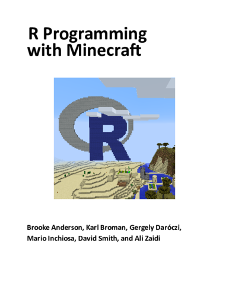
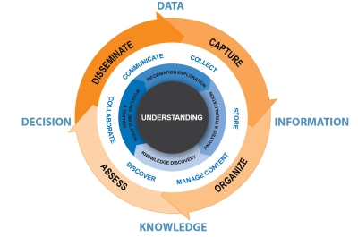
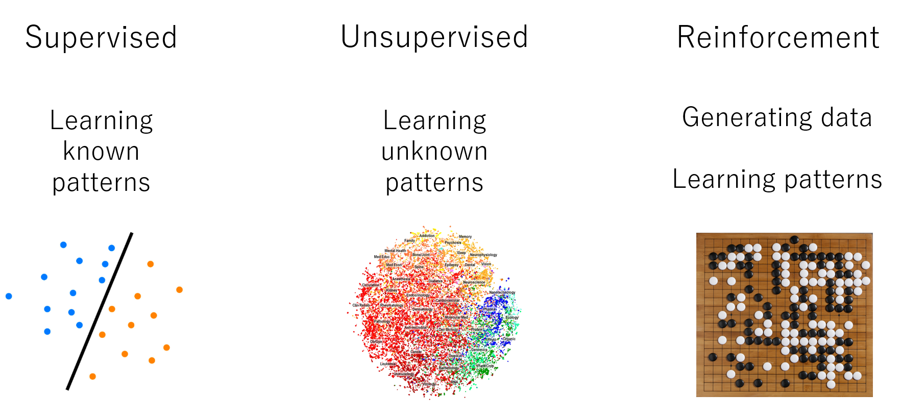
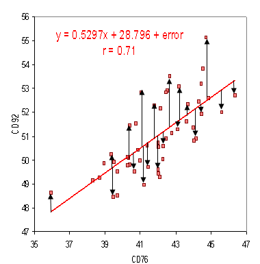
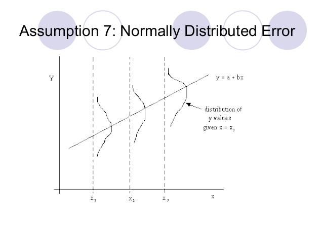
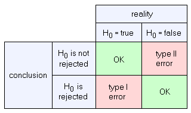
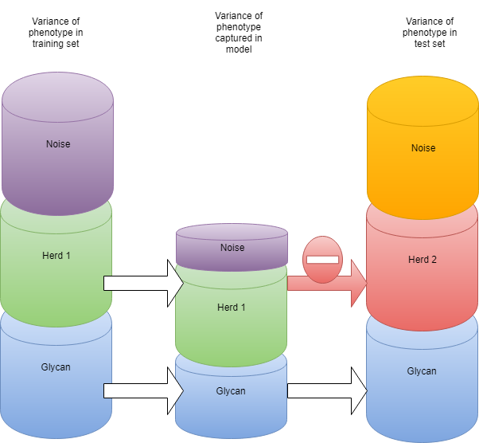
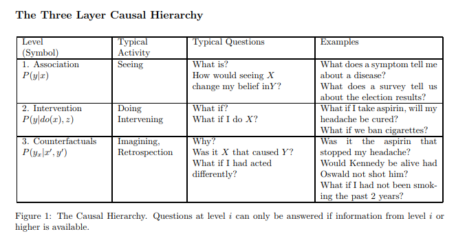

Introduction to R
========================================================
author: Jan Vandepitte
date: 30 August 2018
autosize: true
---


0. What is R
========================================================

  * Open source Script language for statistical programming 
  * data preparation, machine learning, experimentation, visualization (presentation, notebook, shiny dashboard)
  * packaging system (CRAN) like nuget, npm

```r
x <- 1
x + 1
```

```
[1] 2
```

0.1 Origins in LISP
========================================================
LISP -> Scheme -> S -> R (cfr Ecmascript)
 * REPL
 * lambda's
 * reflection (code is data)
 * dynamic (if it quacks like a duck)
 * abstract away underlying system (for domain experts)
 * backed by fast C++, C or Fortran libraries
 * column oriented data structure (APL influence) 
 
 http://paulgraham.com/icad.html
 

0.2 Origins in LISP (demo)
========================================================


```r
myF <- function(x) { x+1 }
myF
```

```
function(x) { x+1 }
```

```r
myF(1)
```

```
[1] 2
```

```r
apply(matrix(c(1,2,3,4),2,2),1,myF)
```

```
     [,1] [,2]
[1,]    2    3
[2,]    4    5
```

1. Why R
========================================================

  * AI coming out of winter (pit of dispair)
  * Omnipresent in AI (Skill like SQL, Ecmascript)
  * Open source, Eco-system, History (de facto standard)
  * different backends (citizen scientist, Big Data, Keras backend)
  * Backed by and integrated in Microsoft products

1.1 Notable R tools in ecosystem
======================================================== 
 * packages: https://cran.r-project.org/
 * IDE Rstudio: https://www.rstudio.com/
 * notable R packages:
   * [dplyr](https://dplyr.tidyverse.org/) and derivatives: high level data wrangling 
   * [shiny](https://shiny.rstudio.com/) : Interactive dashboarding
   * [RCurl](http://www.omegahat.net/RCurl/) : Get data from an API
   * [knitR](https://yihui.name/knitr/): Mix markdown and R (this pres)
   * [ggplot2](http://ggplot2.org/) : Nice graphs
   * [lattice](http://lattice.r-forge.r-project.org/) : Multivariate graphs
   * [devtools](https://www.rstudio.com/products/rpackages/devtools/) : Get packages straight from github and more fun
   * [tableplot](https://cran.r-project.org/web/packages/tabplot/vignettes/tabplot-vignette.html): visualize big datasets
   
1.2 Checklist: Is R the tool for me right now?
========================================================
 * Do I want to use free (like beer) software : yes
 * Do I want to experiment with different models from different creators : yes 
 * Does my data fit in main memory of my computer (no big data ): yes
 * Doesn't my data fit in main memory of my computer : yes with some prerequisites
  
2. R in Microsoft products
========================================================

 * 2015 Microsoft buys Revolution Analytics 
 * R Integrated in several products
 * https://mran.microsoft.com


2.1 Microsoft R Open (R extension)
========================================================
Improved some pittfals of typical R distribution (single threaded, standardization of packages and models, object orientation...) CRAN

(see Typescript)


2.2 Microsoft Machine Learning Server (run time)
========================================================
Client/Server
Operationalizing R 
  * DeployR
  * ScaleR

Now also python

2.3 Microsoft R Archive Network (MRAN)
========================================================
Standardized package, snapshotting in time
https://mran.microsoft.com/

2.4 R in SQL Server
========================================================
Machine learning services in SQL Server


2.5 R in visual studio
========================================================


2.6 R in Power BI
========================================================
Visualization with R? PowerBIR?? (jk :p)


2.7 Azure machine learning
========================================================


2.8 Azure HDInsight (hadoop as a service)
========================================================


http://blog.revolutionanalytics.com/2015/06/using-hadoop-with-r-it-depends.html

2.9 Azure Databricks (spark as a service)
========================================================
R one of the languages on Apache Spark (besides Scala and Python)


2.10 In minecraft
========================================================


https://ropenscilabs.github.io/miner_book/

2.11 Certification as a Data Scientist
========================================================


3. Concepts
========================================================
In the following segment I try to provide a high level run through of basic concepts of AI, machine learning and statistics

3.1 AI
========================================================


3.2 DIKW pyramid
========================================================


3.3 DIKW cycle
========================================================



3.4 Statistics and Machine learning
========================================================


3.5 Error terms
========================================================
In programming we try to reduce the errors in our models (programs) by fixing bugs and doing unit testing.

Reduce Errors Of Our statistical models :
Stochastical element. Error is quantifiable with data.

3.5 Error terms
========================================================


Model is estimation of errorterms of data around model


3.5 Error terms
========================================================


Error has a probability distribution around: assumed to be normal distributed

3.6 Error types : hypothesis testing
========================================================


3.6 Error types : hypothesis testing
========================================================
* type I : incorrectly detect effect when there is none (bias, noise...) : overfitting
* type II : incorrectly detect no effect (0 hypothesis) when there is an effect : underfitting

Programming = mathematical proof testen (https://en.wikipedia.org/wiki/Curry%E2%80%93Howard_correspondence)

3.7 Information = Variance
========================================================


we train our model and test/validate it on the same data

3.7 Information = Variance
========================================================



How related is our training, test our validation data subset? Idempotency of our model.

3.8 Big data - Central Limit Theorem
========================================================
Larger sample size: more normal distribution


with more data, we need less assumptions of underlying error term


3.9 Big data - Power increases with sample size
========================================================


Power is chance that our model will correctly detect an effect. Power will decrease with more features in our model. Power will increase with larger sample size for our model.
More power = less underfitting (less type II error).

Median vs arithmetic average.


3.10 Big data - Data is the new oil
========================================================

Conclusion: the more (quality) data, the better for our models


New headaches: Horizontal scalability, distributed systems, CAP and CALM theoreum ...


3.11 Deep learning
========================================================
deep neural networks, long history, more data and faster hardware (GPU and even TPU)


> When in doubt use brute force ~ Ken Thompson


3.12 Deep learning
========================================================

Renewed interest so some interesting developments
* Auto-encoder (encoder-decoder chained learned with internal representation)
* SEQ2SEQ (arbitrary size representation for e.g. NLP)
* Representation learning (less feature engineering)
* Auto-ML : deep learning for non-experts
* cross platform: tensorflow on RPI and in browser
* Theoretical framework (category theory): a new way of programming but with linear algebra
http://colah.github.io/posts/2015-09-NN-Types-FP/

3.13 Deep learning
========================================================

> Deep learning est mort, vive differentiable programming ~ Yann LeCun - Chief AI facebook

https://medium.com/@karpathy/software-2-0-a64152b37c35
https://www.facebook.com/yann.lecun/posts/10155003011462143
https://techburst.io/deep-learning-est-mort-vive-differentiable-programming-5060d3c55074

3.14 Deep dive theoretical
========================================================

* Basic statistics : https://www.itl.nist.gov/div898/handbook/
* Machine learning : https://dzone.com/articles/35-free-online-books-machine
* https://www.kdnuggets.com/
* https://www.kaggle.com/
* https://www.datasciencecentral.com/

3.15 Level I in Causal hierarchy
========================================================



https://arxiv.org/pdf/1801.04016.pdf

https://www.quantamagazine.org/to-build-truly-intelligent-machines-teach-them-cause-and-effect-20180515/

3.16 Simpson paradox
========================================================


body weight related to disease (men vs women, children vs adults)


4. R for the .NET programmer
========================================================
In knitR it's also possible to run code from other languages:
  * https://yihui.name/knitr/demo/engines/
  * http://datadrivensecurity.info/blog/posts/2015/Jun/running-other-languages-in-r-markdown-files/

So let's add an engine for .net

```r
eng_dotnet <- function(options) {
  # create a temporary file
  f <- basename(tempfile("dotnet", '.', paste('.', "dotnet", sep = '')))
  on.exit(unlink(f)) # cleanup temp file on function exit
  writeLines(options$code, f)
  out <- ''
  # if eval != FALSE compile/run the code, preserving output
  if (options$eval) {
    out <- system(sprintf('dotnet script %s', paste(f, options$engine.opts)), intern=TRUE)
  }
  # spit back stuff to the user
  engine_output(options, options$code, out)
}
knitr::knit_engines$set(dotnet=eng_dotnet)
```
4.0 Let's try out our R-package
========================================================

```r
if (!requireNamespace("devtools", quietly = TRUE)) { install.packages("devtools") }
devtools::install_github("yenwel/Rpresdotnetengine", force=T)
library(Rpresdotnetengine)
knitr::knit_engines$set(dotnet=eng_dotnet)
```

4.1 Let's try out our new engine
========================================================

```dotnet
var i = 1;
i++;
Console.WriteLine(i++);
Console.WriteLine(++i);
Console.WriteLine(i--);
Console.WriteLine(--i);
```

```
2
4
4
2
```

4.2 Basic types (.NET)
========================================================

```dotnet
Console.WriteLine(1);
Console.WriteLine(true);
Console.WriteLine("hello world?");
enum Color {Red, Green, Blue};  
Console.WriteLine(Color.Red);
```

```
1
True
hello world?
Red
```

4.2 Basic types (R)
========================================================

```r
1
```

```
[1] 1
```

```r
2.0
```

```
[1] 2
```

```r
T
```

```
[1] TRUE
```

```r
'hello world?'
```

```
[1] "hello world?"
```

```r
as.factor(c('Red','Green','Blue'))[1];
```

```
[1] Red
Levels: Blue Green Red
```

```r
as.ordered(c('Best','Bester','Bestest'))[1];
```

```
[1] Best
Levels: Best < Bester < Bestest
```

4.3 Collections and composite types (.NET)
========================================================

```dotnet
Console.WriteLine(new [] { 1 , 2 , 3}[1]);
Console.WriteLine(new List<object> { "Fred" , 20}[0]);
Console.WriteLine(new Dictionary<string,object>{{"name","Fred"},{"age",20}}["name"]);
Console.WriteLine(new { Name = "Fred", Age = 20});
```

```
2
Fred
Fred
{ Name = Fred, Age = 20 }
```

4.3 Collections and composite types (R)
========================================================

```r
c(1,2,3)
```

```
[1] 1 2 3
```

```r
matrix(1:9, nrow=3,ncol=3)
```

```
     [,1] [,2] [,3]
[1,]    1    4    7
[2,]    2    5    8
[3,]    3    6    9
```

```r
list(name="Fred",  age=20)
```

```
$name
[1] "Fred"

$age
[1] 20
```

```r
# R has at least three ways to do OO (S3, S4, Reference class) but don't bother do FP rather
```

4.3 Collections and composite types (R)
========================================================

```r
array(1:16,dim = c(2,2,2,2))[,,2,2]
```

```
     [,1] [,2]
[1,]   13   15
[2,]   14   16
```

```r
data.frame(name = c("Buddy", "Lisa"), age = c(10, 38), sex = as.factor(c("m","f")))
```

```
   name age sex
1 Buddy  10   m
2  Lisa  38   f
```

4.4 Functions (.NET)
========================================================

```dotnet
Func<int,int> myF = (int x) => x + 1;
Console.WriteLine(myF);
Console.WriteLine(myF(1));
Console.WriteLine(new [] {1 , 2 , 3 , 4}.Select(myF).FirstOrDefault());
```

```
System.Func`2[System.Int32,System.Int32]
2
2
```

4.4 Functions (R)
========================================================

```r
myF <- function(x) { x+1 }
myF
```

```
function(x) { x+1 }
```

```r
myF(1)
```

```
[1] 2
```

```r
apply(matrix(c(1,2,3,4),2,2),1,myF)
```

```
     [,1] [,2]
[1,]    2    3
[2,]    4    5
```

4.5 Deep dive into R
========================================================

start here:
* https://www.statmethods.net/
* https://www.r-bloggers.com/
* https://www.datacamp.com/

then google (CRAN because R is to confusing for google)


```r
??something
```

5. Demo's
========================================================
  * supply chain analysis : 
    * https://github.com/yenwel/SCOperationsInventory
    * https://github.com/yenwel/supplychainplanning
  * shiny app connecting to database: https://github.com/yenwel/shinyDatabaseExplorer
  * analyse load tests (connect to db): https://github.com/yenwel/analyse-neustar-loadtest
  * process IIS Url Rewrite xml: https://github.com/yenwel/processsUrlRewrite
  * this presentation: https://github.com/yenwel/R-presentation
  * An R-package for the knitr dotnet engine: https://github.com/yenwel/Rpresdotnetengine

5.1 Shiny App
========================================================

<iframe src="https://bovi-analytics.shinyapps.io/GplusEdata/" width="100%" height ="300%"></iframe>

5.2 data mining bitcoin and twitter
========================================================

```r
#http://beautifuldata.net/2015/01/querying-the-bitcoin-blockchain-with-r/
library(Rbitcoin)
trades <- market.api.process('kraken',c('BTC','EUR'),'trades')
Rbitcoin.plot(trades, col='blue')
```


5.2 data mining bitcoin and twitter
========================================================


```r
## load rtweet package
library(rtweet)
# these environment variables are set via an app you can make at https://developer.twitter.com/en/apps
envvar <- Sys.getenv(c("TWT_R_APP", "TWT_R_API", "TWT_R_SECRET","TWT_R_XS_TOKEN","TWT_R_XS_SECRET"))
appname <- envvar[1]
key <- envvar[2]
secret <- envvar[3]
access_token <- envvar[4]
access_secret <- envvar[5]
## authenticate via access token
token <- create_token(
  app = appname, 
  consumer_key = key, 
  consumer_secret = secret, 
  access_token = access_token, 
  access_secret = access_secret)
bitcoin_tweets <- search_tweets(q = "#bitcoin", n = 15000 , retryonratelimit=F)
```

5.2 datamining bitcoin and twitter
========================================================

```r
str(trades)
```

```
List of 6
 $ market          : chr "kraken"
 $ base            : chr "BTC"
 $ quote           : chr "EUR"
 $ timestamp       : POSIXct[1:1], format: "2018-08-29 16:55:40"
 $ market_timestamp: POSIXct[1:1], format: NA
 $ trades          :Classes 'data.table' and 'data.frame':	1000 obs. of  5 variables:
  ..$ date  : POSIXct[1:1000], format: "2018-08-29 13:48:58" ...
  ..$ price : num [1:1000] 6088 6088 6088 6088 6086 ...
  ..$ amount: num [1:1000] 6 1 0.015 0.1254 0.0571 ...
  ..$ tid   : chr [1:1000] NA NA NA NA ...
  ..$ type  : chr [1:1000] "bid" "bid" "ask" "ask" ...
  ..- attr(*, ".internal.selfref")=<externalptr> 
```
5.2 datamining bitcoin and twitter
========================================================

```r
summary(trades)
```

```
                 Length Class      Mode     
market           1      -none-     character
base             1      -none-     character
quote            1      -none-     character
timestamp        1      POSIXct    numeric  
market_timestamp 1      POSIXct    numeric  
trades           5      data.table list     
```
5.2 datamining bitcoin and twitter
========================================================

```r
summary(trades$trades)
```

```
      date                         price          amount         
 Min.   :2018-08-29 13:48:58   Min.   :6040   Min.   : 0.000000  
 1st Qu.:2018-08-29 14:08:24   1st Qu.:6058   1st Qu.: 0.007653  
 Median :2018-08-29 14:27:30   Median :6067   Median : 0.037494  
 Mean   :2018-08-29 14:25:34   Mean   :6068   Mean   : 0.221987  
 3rd Qu.:2018-08-29 14:43:03   3rd Qu.:6081   3rd Qu.: 0.132130  
 Max.   :2018-08-29 14:55:31   Max.   :6094   Max.   :10.000000  
     tid                type          
 Length:1000        Length:1000       
 Class :character   Class :character  
 Mode  :character   Mode  :character  
                                      
                                      
                                      
```

5.2 datamining bitcoin and twitter
========================================================

```r
summary(trades$trades$date)
```

```
                 Min.               1st Qu.                Median 
"2018-08-29 13:48:58" "2018-08-29 14:08:24" "2018-08-29 14:27:30" 
                 Mean               3rd Qu.                  Max. 
"2018-08-29 14:25:34" "2018-08-29 14:43:03" "2018-08-29 14:55:31" 
```

5.2 datamining bitcoin and twitter
========================================================

```r
str(bitcoin_tweets)
```

```
'data.frame':	0 obs. of  0 variables
```
5.2 datamining bitcoin and twitter
========================================================

```r
summary(bitcoin_tweets)
```

```
< table of extent 0 x 0 >
```
5.2 datamining bitcoin and twitter
========================================================

```r
summary(bitcoin_tweets$created_at)
```

```
Length  Class   Mode 
     0   NULL   NULL 
```


5.2 datamining bitcoin and twitter
========================================================

```r
mintime <-max(min(trades$trades$date),min(bitcoin_tweets$created_at))
maxtime <- min(max(bitcoin_tweets$created_at),max(trades$trades$date))
tradesinrange <- trades$trades[trades$trades$date >= mintime & trades$trades$date <= maxtime,]
tweetsinrange <- bitcoin_tweets[bitcoin_tweets$created_at >= mintime & bitcoin_tweets$created_at <= maxtime,]
mintime
```

```
[1] NA
```

```r
maxtime
```

```
[1] -Inf
```

```r
summary(tradesinrange$date)
```

```
   Min. 1st Qu.  Median    Mean 3rd Qu.    Max. 
     NA      NA      NA      NA      NA      NA 
```

```r
summary(tweetsinrange$created_at)
```

```
Length  Class   Mode 
     0   NULL   NULL 
```

5.2 datamining bitcoin and twitter
========================================================


```
Error in seq.int(0, to0 - from, by) : 'to' must be a finite number
```
